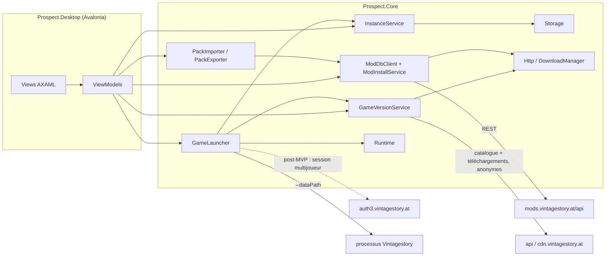
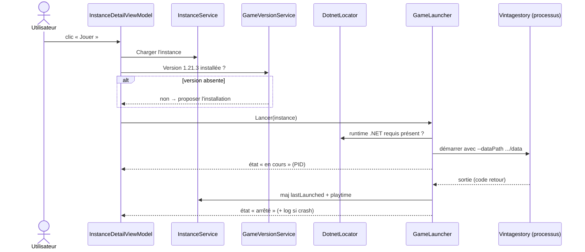

# Prospect : architecture proposée

Statut : proposition du 2026-08-10, en attente de validation. Rien de ce document n'est
implémenté. Les points marqués « à confirmer » renvoient aux documents de recherche
dans [docs/research/](research/).

Prospect est un launcher pour Vintage Story dans l'esprit de Prism Launcher : des
instances isolées (un dossier = une version du jeu, des mods, des configs, des mondes),
un catalogue de versions du jeu installées côte à côte, et un client du ModDB officiel.
VS Launcher, la référence communautaire, est archivé depuis juin 2026. Vintage Story
supporte nativement `--dataPath`, ce qui rend l'isolation d'instances triviale côté jeu :
tout le travail est côté launcher.

## Principes

Le cœur du projet est la séparation stricte entre logique et interface. Tout ce qui se
teste vit dans `Prospect.Core`, un projet .NET sans la moindre référence à Avalonia.
L'interface (`Prospect.Desktop`) n'est qu'une peau MVVM par-dessus : des ViewModels
minces qui appellent les services du Core. Cette frontière n'est pas négociable, c'est
elle qui rend le TDD praticable et qui permet d'intégrer le design fourni par Claude
Design (déjà livré, conservé hors dépôt dans `design/` en local) sans toucher à la
logique.

Deuxième principe : le système de fichiers est la source de vérité. Pas de base de
données. Une instance existe parce que son dossier existe, un mod est installé parce que
son zip est dans `Mods/`. L'utilisateur peut intervenir à la main dans les dossiers sans
casser le launcher, qui rescanne au lieu de faire confiance à un état interne. Prism
fonctionne comme ça depuis des années et c'est ce qui le rend robuste.

## Décisions structurantes

**Cible `net10.0`.** La contrainte du projet est « .NET 8+ ». .NET 8 sort de support en
novembre 2026, dans trois mois. .NET 10 est le LTS courant, le SDK 10.0.110 est déjà
installé sur la machine de dev, et Avalonia 11.3 le supporte. Partir sur .NET 8
aujourd'hui, c'est planifier une migration avant même la première release.

**Deux projets source, pas quatre.** Pas de découpage Domain / Application /
Infrastructure : sur un launcher solo en MVP, ces couches coûtent plus qu'elles ne
rapportent. `Prospect.Core` contient tout, organisé en dossiers par domaine métier, avec
des interfaces là où la testabilité l'exige (système de fichiers, HTTP, horloge). Si un
domaine grossit au point de le justifier, on extraira un projet à ce moment-là.

**Testabilité par abstraction des effets de bord.** `System.IO.Abstractions` pour le
système de fichiers (les tests utilisent `MockFileSystem`, aucun fichier réel), des
`HttpMessageHandler` factices pour le réseau, une interface `IClock` pour le temps. Les
services du Core reçoivent tout par injection (constructeurs), conteneur
`Microsoft.Extensions.DependencyInjection` composé dans l'app.

**Sérialisation `System.Text.Json` avec source generators.** Pas de Newtonsoft. Les
schémas (instance.json, manifests, réponses API) sont des records C# annotés, le
générateur de source évite la réflexion et prépare un éventuel AOT.

**Résilience réseau via `Microsoft.Extensions.Http.Resilience`** (retry avec backoff sur
les téléchargements et appels API), plutôt qu'un Polly câblé à la main.

**Stack de test : xUnit + NSubstitute + coverlet.** NSubstitute plutôt que Moq
(l'épisode SponsorLink a suffi). Pour les assertions, FluentAssertions est devenu payant
en v8 ; je propose Shouldly, ou les asserts xUnit nus si tu préfères zéro dépendance.
Point ouvert n° 3.

**UI : Avalonia 11.3, CommunityToolkit.Mvvm, bindings compilés** (`x:DataType` partout,
`AvaloniaUseCompiledBindingsByDefault`). Navigation maison légère : un `ShellViewModel`
qui expose la page courante, pas de framework de navigation tiers.

## Patterns de conception

Les patterns attendus, par famille, pour que chaque PR les applique et que la review
les vérifie. La règle générale : de petits objets cohérents, composés par injection de
constructeur, jamais d'état statique muable, jamais de service locator.

**Value objects immuables** pour tout ce qui est une valeur : `GameVersion`,
`ModVersion`, `VersionRequirement`, plus tard les identifiants. Égalité structurelle,
comparateurs explicites, sérialisation par converter dédié.

**Ports et adaptateurs, version pragmatique** : chaque effet de bord passe par une
interface injectée (`IFileSystem`, `IClock`, `IAppEnvironment`, `HttpMessageHandler`
factice en test, `ISecretStore` plus tard). La logique ne touche jamais le monde
directement, c'est ce qui rend le TDD réel.

**Repository** pour la persistance scannée : `IInstanceRepository`,
`IGameVersionRepository`. Le système de fichiers est la base de données, le repository
est le seul à connaître sa topologie.

**Services applicatifs par domaine** (`InstanceService`, `GameInstallService`,
`GameLauncher`, `ModInstallService`...) : la façade que consomment les ViewModels. Un
ViewModel ne compose jamais de logique métier à partir de briques plus basses.

**Strategy par OS** pour tout ce qui diverge entre plateformes : installation du jeu
(installeur Inno silencieux contre tar.gz + chmod), commande de lancement, chemins.
Une interface, une implémentation par plateforme, sélection à la composition, jamais
de `if (OperatingSystem.IsWindows())` disséminés dans les services.

**Progression et état observables** : `IProgress<T>` et évènements pour les
téléchargements et le cycle de vie du processus de jeu ; `CancellationToken` sur toute
opération longue, sans exception.

**Pipeline de migrations** ordonné pour les schémas versionnés (instance.json,
prospect.json) : une migration = une classe testée, appliquées en chaîne au chargement.

**MVVM strict** côté Desktop : CommunityToolkit.Mvvm, bindings compilés, zéro logique
en code-behind, ViewModels constructibles sans UI.

Les erreurs attendues du domaine sont des exceptions typées du projet (jamais
d'`Exception` nue), et les cas « absence normale » (fichier pas encore créé) sont des
retours nullables, pas des exceptions.

## Solution et arborescence

```
Prospect/
├── Prospect.sln
├── global.json                    # SDK 10.0.1xx épinglé, rollForward latestFeature
├── Directory.Build.props          # nullable, TreatWarningsAsErrors, analyzers, version
├── Directory.Packages.props       # gestion centralisée des versions de paquets
├── .editorconfig
├── .github/workflows/ci.yml
├── src/
│   ├── Prospect.Core/             # logique métier, zéro référence UI
│   └── Prospect.Desktop/          # Avalonia, MVVM, composition root
├── tests/
│   ├── Prospect.Core.Tests/       # xUnit, la cible de coverage
│   └── Prospect.Desktop.Tests/    # Avalonia.Headless, smoke tests (léger au début)
└── docs/
    ├── architecture.md            # ce document
    ├── adr/                       # décisions notables, une page par décision
    └── research/                  # documents d'exploration (API ModDB, VS Launcher)
```

`Prospect.Core` s'organise par domaine, un dossier = un namespace :

```
Prospect.Core/
├── Common/          # GameVersion et ModVersion (parsing, comparaison), erreurs, IClock
├── Storage/         # AppPaths (XDG/AppData), JsonFileStore (écritures atomiques), settings
├── Instances/       # modèle Instance, InstanceService (CRUD), scan du dossier instances/
├── GameVersions/    # catalogue distant, installations locales, téléchargement, extraction
├── Runtime/         # détection du runtime .NET requis par le jeu
├── Auth/            # (post-MVP) session compte vintagestory.at pour le multijoueur
├── Launching/       # construction de la ligne de commande, suivi du processus, playtime
├── ModDb/           # client API, recherche, installation, provenance, détection de MàJ
├── Modpacks/        # manifest, export, import
└── Http/            # DownloadManager partagé (progression, annulation, checksum)
```

La dépendance entre domaines va dans un seul sens : `ModDb`, `GameVersions` et
`Modpacks` s'appuient sur `Http` et `Storage` ; `Launching` s'appuie sur `Instances`,
`GameVersions` et `Runtime` ; personne ne dépend de `ModDb` sauf `Modpacks`. `Common` et
`Storage` ne dépendent de rien.



## Modèle de données

### Arborescence disque

Tout vit sous une racine unique, relocalisable dans les réglages. Par défaut :
`$XDG_DATA_HOME/prospect` sur Linux (soit `~/.local/share/prospect`),
`%APPDATA%\Prospect` sur Windows, `~/Library/Application Support/Prospect` sur macOS.

```
prospect/
├── prospect.json                  # réglages globaux
├── instances/
│   └── homestead-121/             # slug dérivé du nom, unique
│       ├── instance.json          # métadonnées, hors de portée du jeu
│       ├── prospect-mods.json     # provenance ModDB des mods installés (cache)
│       └── data/                  # la cible de --dataPath
│           ├── Mods/              # les .zip des mods
│           ├── ModConfig/
│           ├── Saves/
│           └── ...                # le jeu écrit ce qu'il veut ici
├── versions/
│   ├── 1.21.3/                    # une installation complète du jeu
│   └── 1.20.12/
├── cache/
│   ├── downloads/                 # archives en cours ou terminées
│   └── http/                      # cache léger des réponses ModDB
└── logs/
```

Le point important : `instance.json` est à côté de `data/`, pas dedans. Le jeu écrit
librement dans son dataPath (clientsettings.json, logs, etc.) et ne doit jamais pouvoir
entrer en collision avec nos métadonnées.

### instance.json (schéma v1)

```json
{
  "schemaVersion": 1,
  "id": "0c9c1f57-8b2e-4f2a-9c41-3d8a12f7b6e0",
  "name": "Homestead 1.21",
  "gameVersion": "1.21.3",
  "icon": "builtin:default",
  "createdUtc": "2026-08-10T14:00:00Z",
  "lastLaunchedUtc": null,
  "totalPlaytimeSeconds": 0,
  "launch": {
    "extraArgs": [],
    "env": {}
  },
  "notes": ""
}
```

Choix qui méritent une ligne d'explication :

`id` est un GUID immuable : renommer l'instance change `name` et éventuellement le slug
du dossier, jamais l'identité. `icon` vaut `builtin:<nom>` pour les icônes embarquées ou
`file:icon.png` pour un fichier copié dans le dossier de l'instance. `schemaVersion`
existe dès le premier jour, avec une chaîne de migrations testée au chargement : c'est
beaucoup moins cher maintenant que dans six mois.

La liste des mods n'est volontairement pas ici. La vérité, ce sont les zips dans
`data/Mods/` : le joueur peut en déposer à la main, le launcher rescanne et parse les
`modinfo.json`. Ce qu'on garde à part, dans `prospect-mods.json`, c'est la provenance de
ce que nous avons installé (modid ModDB, fileid, version au moment de l'installation)
pour rendre la détection de mises à jour exacte. Ce fichier est un cache : le supprimer
dégrade l'expérience (on retombe sur la correspondance par modid), il ne casse rien.

### prospect.json (réglages globaux, v1 minimale)

Langue de l'UI, chemin racine si déplacé, préférences de téléchargement (parallélisme),
et la référence de session du compte vintagestory.at (jamais le mot de passe, voir plus
bas). Tout le reste attendra d'exister.

### Manifest de modpack (prospect-pack.json, v1)

```json
{
  "schemaVersion": 1,
  "name": "Pack exemple",
  "author": "Pixnop",
  "gameVersion": "1.21.3",
  "mods": [
    { "modId": "carrycapacity", "version": "1.8.0", "fileId": 12345, "sha256": null }
  ]
}
```

L'export produit ce fichier (seul ou zippé avec, en option, le dossier `ModConfig/` de
l'instance). L'import crée une instance, installe la version du jeu si absente, résout
chaque mod via le ModDB (par `modId` + `version`, `fileId` en raccourci quand il est
encore valide) et produit un rapport listant ce qui n'a pas pu être résolu. Le manifest
reste portable : aucune URL signée, aucun chemin absolu.

## Les domaines du Core, dans l'ordre du MVP

### 1. Instances

`InstanceService` : créer (nom → slug unique, écriture de `instance.json`, création de
`data/`), dupliquer (copie récursive de `data/` avec progression et annulation, nouveau
GUID), renommer, supprimer (après confirmation côté UI ; suppression définitive en MVP),
lister (scan de `instances/*/instance.json`, les dossiers illisibles remontent comme
« instances cassées » au lieu de faire planter le scan).

L'écran de détail maquetté par le design ajoute deux besoins légers ici : lister les
mondes d'une instance (scan de `data/Saves/`, nom, taille, date) et exposer son journal
(le log du dernier lancement). Autant les prévoir dans le domaine que les découvrir en
branchant l'UI.

### 2. Versions du jeu

La recherche ([research/vslauncher-et-distribution.md](research/vslauncher-et-distribution.md))
a tranché la question qui conditionnait tout ce domaine : le téléchargement du jeu est
entièrement public. Le catalogue vit sur `https://api.vintagestory.at/stable.json` et
`unstable.json` (API qualifiée de publique par ses mainteneurs), et les fichiers sont
servis anonymement par un CDN BunnyCDN plus un miroir nginx, vérifié en live. **L'auth
compte sort donc du MVP**, voir la section post-MVP.

Le catalogue donne, par version puis par plateforme (`windows`, `linux`, `mac-x64`,
`mac-arm64`, plus les serveurs) : `filename`, `filesize` (chaîne humaine du type
« 590.5 MB », pas des octets), `md5`, deux miroirs `urls.cdn` et `urls.local`, et un
flag `latest`. Les canaux se déduisent du nom de version (`-rc.N`, `-pre.N`), pas d'un
champ dédié.

Deux repositories : le catalogue distant et les installations locales (scan de
`versions/`, un fichier sentinelle `.prospect-complete` écrit en fin d'installation pour
détecter les installations interrompues). `GameInstallService` orchestre :
téléchargement dans `cache/downloads/` via le `DownloadManager` avec repli automatique
sur le second miroir, vérification du md5 annoncé (VS Launcher exposait ce champ sans
jamais le vérifier, on fera mieux pour trois lignes de code), puis une stratégie
d'installation par OS :

- Linux et macOS : extraction du `.tar.gz`, puis restauration explicite des bits
  d'exécution (`chmod 755` récursif) car l'extraction ne les préserve pas et le binaire
  natif `Vintagestory` ne se lance pas sans ça ;
- Windows : il n'existe pas de build portable, uniquement un installeur Inno Setup. On
  reprend le pattern éprouvé de VS Launcher : exécution silencieuse avec
  `/VERYSILENT /SUPPRESSMSGBOXES /NORESTART /CURRENTUSER /NOICONS /DIR=<versions/X.Y.Z>`.

macOS est traité comme une cible réelle dès le modèle (téléchargement et extraction des
builds `mac-arm64`/`mac-x64` fonctionnels), même si le bouton « Jouer » mac attendra une
vraie machine de test : VS Launcher a laissé ses utilisateurs mac des années avec un
« not yet supported » faute d'avoir anticipé.

### 3. Lancement

La commande est confirmée par la recherche : sur Linux on exécute le binaire natif
`<versions/X.Y.Z>/Vintagestory` avec `--dataPath=<chemin absolu vers data/>`, sur
Windows `Vintagestory.exe` avec les mêmes arguments. `GameLauncher` valide (version
installée ? runtime présent ?), construit la commande via
`ProcessStartInfo.ArgumentList` (les `extraArgs` de l'instance sont une vraie liste,
jamais une chaîne collée : VS Launcher passait les paramètres utilisateur comme un seul
argv et c'était fragile), injecte les variables d'environnement de l'instance (utile
par exemple pour `MESA_GLTHREAD=true` sur Linux), démarre le processus, capture
stdout/stderr vers `logs/instance-<slug>.log`, suit l'état (une instance en cours ne se
relance pas) et met à jour `lastLaunchedUtc` et le playtime à la sortie.

`Runtime/` détecte le .NET du système (`dotnet --list-runtimes`) et le compare au requis
de la version du jeu (table dans le Core : les versions récentes du jeu s'étalent sur
.NET 7, 8 ou 10 selon la version). C'est un vrai différenciateur : VS Launcher ne
faisait aucune détection, sa doc demandait d'installer les trois majors à la main et ses
mainteneurs listaient ce point comme une friction jamais résolue. En MVP on ne
télécharge pas de runtime, on diagnostique et on explique précisément quoi installer ;
l'interface `IDotnetLocator` laisse la porte ouverte à un runtime géré façon Prism/Java
après le MVP.

### 4. Client ModDB

`ModDbClient` est un client REST typé sur `mods.vintagestory.at/api`, dont le schéma
réel est documenté dans [research/moddb-api.md](research/moddb-api.md) (croisement du
code PHP du site et d'appels live). Trois particularités structurent le client. Il n'y
a aucune pagination : `/api/mods` renvoie le catalogue entier (7 994 mods, 3,5 Mo) en
un appel, donc on le met en cache local avec un TTL et la recherche filtre en mémoire.
Sur l'API v1, le code HTTP ment : les erreurs applicatives arrivent en HTTP 200 avec un
champ JSON `statuscode` (une chaîne), donc l'enveloppe de désérialisation lit ce champ
au lieu de faire confiance à `IsSuccessStatusCode`. Et les DTOs sont défensifs : champs
souvent `null` (`logo`, `urlalias`), `tagid` de version de jeu en `long`, dates tantôt
chaînes SQL tantôt timestamps Unix selon la génération d'endpoint. `ModInstallService` télécharge le zip
d'une release dans `data/Mods/` sous le nom `<modid>-<version>.zip` (la convention de
VS Launcher, lisible et stable) et enregistre la provenance. La désinstallation supprime
le zip. L'activation/désactivation sans suppression est un renommage (`.zip` →
`.zip.disabled`), à valider par un test réel du jeu en début d'implémentation ; VS
Launcher n'offrait aucun mécanisme de ce genre, c'est un manque documenté qu'on comble.

Attention au parsing des `modinfo.json` : dans la nature, la casse des clés varie
(`modid`, `Modid`, `ModID`...) et les fichiers contiennent parfois commentaires et
virgules terminales (VS Launcher les parsait en JSON5). Notre `ModInfoParser` sera
tolérant : `System.Text.Json` avec `JsonCommentHandling.Skip`, `AllowTrailingCommas` et
une résolution de clés insensible à la casse, plus des tests nourris d'échantillons
réels collectés pendant la recherche.

La détection de mises à jour s'appuie sur `/api/updates?mods=a@v1,b@v2` : un seul appel
pour tous les mods installés, qui ne renvoie que ceux en retard, avec leurs releases et
les versions de jeu taguées. Deux subtilités sorties de la recherche. Les tags de
compatibilité d'une release sont des cases cochées à la main par l'auteur sur le site,
jamais recalculées depuis le modinfo.json : des oublis arrivent, donc l'UI proposera un
mode « élargir à la même série 1.21.x », clairement signalé comme approximatif. Et
l'absence d'un mod dans la réponse ne distingue pas « à jour » de « inconnu du ModDB » :
on compare aux clés envoyées. L'endpoint v2 `install-information`, qui raisonne par
version de jeu cible, est une piste plus riche à évaluer pendant l'implémentation.

Les contraintes de version des `dependencies` du modinfo.json sont des bornes minimales
(comparaison `>=` sémantique, `""` ou `"*"` pour « toute version »), pas des versions
exactes ni des wildcards `1.20.*` : cette syntaxe n'existe nulle part, la recherche l'a
établi contre le wiki, la doc de l'assembly du jeu et des échantillons réels. Notre type
`ModVersion` implémente donc parsing `X.Y.Z[-dev|pre|rc.N]`, ordre
`dev < pre < rc < stable` et comparaison `>=`. Du pur calcul, écrit en TDD strict dès la
PR des fondations, nourri des échantillons collectés.

### 5. Modpacks

Décrit plus haut avec le manifest. L'import réutilise tout l'existant (création
d'instance, installation de version, installation de mods) : c'est le test d'intégration
naturel de l'ensemble du Core.

### Transverse : téléchargements

Un seul `DownloadManager` pour le jeu et les mods : file de téléchargements,
`IProgress<DownloadProgress>` (octets, total, vitesse), `CancellationToken` partout,
reprise sur erreur réseau via la politique de résilience, vérification de checksum
quand la source en fournit. L'UI « Téléchargements » n'est qu'une vue sur cette file.



## UI Avalonia et design system

Le design est déjà livré : le handoff Claude Design vit dans `design/`, en local et
volontairement hors dépôt (tokens CSS, 26 composants de référence, guidelines, et un
ui_kit qui maquette la fenêtre complète écran par écran, à 1280×800). Les agents
d'implémentation UI le lisent sur cette machine ; le dépôt public n'en contient que la
transposition Avalonia. Il a été conçu pour Avalonia : couleurs
plates, ombres simples transposables en `BoxShadow`, hauteurs de contrôles fixes, aucun
blur, aucune animation exotique. Le travail UI n'est donc pas de créer un design mais
de transposer fidèlement celui-là.

La structure des vues suit les écrans du ui_kit :

```
Prospect.Desktop/
├── App.axaml / App.axaml.cs       # composition root : DI, thèmes
├── Views/ et ViewModels/
│   ├── Shell                      # titlebar custom 38px, sidebar 216px, popover téléchargements, toasts
│   ├── Home                       # grille d'instances, recherche/tri, état vide
│   ├── Instance                   # détail : onglets Mods / Mondes / Journal / Options
│   ├── ModBrowser                 # recherche ModDB, filtres, fiche mod, mode hors-ligne
│   ├── Versions                   # canaux, installées vs disponibles, progression
│   ├── Wizard                     # création d'instance en 4 étapes
│   ├── Settings                   # Général / Jeu / Réseau / Comptes / À propos
│   └── FirstRun                   # checklist de premier lancement
├── Services/                      # DialogService, StorageProvider (pickers)
├── Styles/
│   ├── Tokens/                    # port 1:1 de design/tokens/*.css en ResourceDictionary
│   └── Controls/                  # ControlThemes : Button, Input, Badge, InstanceCard...
└── Assets/                        # logo, icône d'app, polices, géométries d'icônes
```

Le port des tokens est mécanique, et c'est voulu : chaque variable CSS
(`--copper-500`, `--bg-surface`, `--channel-stable`...) devient une ressource Avalonia
du même nom, thème sombre par défaut et variante claire via les `ThemeVariant`. Les
trois polices (IBM Plex Sans, IBM Plex Mono, Space Grotesk, toutes SIL OFL) s'embarquent
en ressources ; les ~34 icônes Lucide inlinées dans le design se portent en géométries
`PathIcon`. Le vocabulaire des canaux du design (`stable`, `unstable`, `pre`,
`incompatible`) mappe exactement notre modèle de versions.

Deux points de vigilance relevés à la lecture du handoff. La titlebar custom (38 px,
fenêtre sans décorations système) est simple sur Windows mais sensible sous
Linux/Wayland : la PR du shell devra trancher entre décorations client partout ou repli
sur la barre native selon la plateforme. Et les quatre états système maquettés (nominal,
aucune instance, ModDB injoignable, premier lancement) sont des états de ViewModel à
modéliser dès le début, pas des écrans à rajouter après coup.

Les règles restent : aucun code-behind au-delà d'`InitializeComponent`, ViewModels
constructibles sans UI (testables en headless), textes en français centralisés dans un
dictionnaire de ressources. La voix du produit est spécifiée dans le readme du design :
tutoiement, casse de phrase, boutons à l'infinitif, valeurs machine en monospace,
jamais d'emoji.

## Qualité et CI

Le workflow `ci.yml` tourne sur push vers `main` et sur toute PR :

1. **build-test** en matrice `ubuntu-latest` / `windows-latest` / `macos-latest` :
   restore avec cache NuGet, `dotnet build -warnaserror`, `dotnet test` avec collecte de
   coverage (coverlet, format opencover + cobertura). Le seuil de coverage sur
   `Prospect.Core` est appliqué par coverlet au moment du test : sous le seuil, le job
   échoue, localement comme en CI. Proposition : 80 % de lignes pour commencer
   (point ouvert n° 4).
2. **sonarcloud** sur ubuntu uniquement : `dotnet-sonarscanner begin` / build / tests
   avec coverage / `end`, avec `sonar.qualitygate.wait=true` pour que la quality gate
   soit réellement bloquante sur la PR.
3. **format** : `dotnet format --verify-no-changes`, le garde-fou de style le moins
   cher qui existe.

La protection de branche sur `main` exige les trois. Merge en squash, titre de PR au
format conventional commits vérifié par une action, ce qui donne un historique propre
sans dépendre de la discipline de chaque commit intermédiaire. Tout ce qui entre dans
l'historique git est en anglais : messages de commit, titres et corps de PR (le squash
reprend titre + corps). Les docs du repo et les docstrings restent en français. Auteur des commits :
Léon uniquement (identité `Pixnop` + adresse noreply), jamais de co-auteur, aucune
mention d'outil dans les messages. Rien de l'outillage Claude Code n'est versionné :
le `.gitignore` de la PR 0 exclut `graphify-out/`, `CLAUDE.md`, `design/` (le handoff
reste une référence locale) et tout artefact de session.

À prévoir côté SonarCloud (actions manuelles, une fois, au moment de la PR
d'infrastructure) : créer le projet sur sonarcloud.io lié au repo GitHub, désactiver
l'Automatic Analysis (incompatible avec l'analyse CI qui porte le coverage), créer le
secret `SONAR_TOKEN` dans le repo. Je fournirai la checklist exacte.

Dependabot dès le début (nuget + github-actions, hebdomadaire) : sur un projet neuf ça
ne coûte rien et ça évite de dériver.

## Roadmap des PRs

Chaque PR part d'une branche, arrive verte (CI + quality gate + seuil de coverage) et
est revue par moi avant que tu ne merges. Modèle d'agent indicatif par PR, à affiner à
chaque lancement.

| PR | Contenu | Agent |
|----|---------|-------|
| 0 | Solution, projets vides, CI complète, SonarCloud, docs, README | Sonnet |
| 1 | Fondations : AppPaths, JsonFileStore atomique, `GameVersion`/`ModVersion` + comparateurs, IClock | Sonnet |
| 2 | Feature 1 : modèle et service d'instances (créer, dupliquer, supprimer, scanner, migrer) | Sonnet |
| 3 | Design system Avalonia : tokens, thèmes sombre/clair, polices, icônes, ControlThemes | Sonnet |
| 4 | Shell + Home + Wizard : titlebar, sidebar, navigation, grille d'instances branchée | Sonnet |
| 5 | Feature 2 : catalogue public, téléchargement (md5 + miroir), installation par OS, écran Versions | Opus |
| 6 | Feature 3 : lancement, suivi du processus, playtime, onglets Mondes et Journal | Sonnet |
| 7 | Feature 4a : client ModDB + ModBrowser + installation de mods | Opus |
| 8 | Feature 4b : détection de mises à jour | Sonnet |
| 9 | Feature 5 : manifest, export, import de modpacks | Sonnet |

Les écrans Settings et FirstRun se remplissent au fil des features plutôt qu'en une PR
dédiée. La PR 5 reste la plus lourde (réseau robuste, trois stratégies d'installation
par OS) mais elle a dégonflé depuis que la recherche a montré que l'auth n'y a aucune
place ; elle peut avancer en parallèle des PRs 3 et 4, qui ne partagent avec elle que
les fondations.

## Après le MVP (repéré pendant la recherche, hors périmètre actuel)

La connexion au compte vintagestory.at devient une feature de confort multijoueur : le
contrat est connu (`POST auth3.vintagestory.at/v2/gamelogin` en form-urlencoded, champs
`email`/`password`/`totpcode`/`prelogintoken`, trois cas d'erreur dont le 2FA en deux
passes) et le résultat s'injecte dans le `clientsettings.json` du dataPath juste avant
le lancement, c'est le jeu qui s'authentifie, pas le launcher. Sans compte connecté, le
jeu démarre très bien en mode non authentifié. Quand on la fera, la session ira dans un
vrai stockage de secrets (`ISecretStore` : fichier 600 d'abord, trousseau OS ensuite),
pas en clair dans la config comme le faisait VS Launcher.

Également notés pour plus tard : sauvegardes automatiques d'instance avant lancement
(VS Launcher le faisait, les joueurs y tiennent), installation automatique du runtime
.NET manquant, lancement macOS (téléchargement et extraction déjà gérés en MVP),
corbeille système à la suppression d'instance. À surveiller aussi : Rustory, le
successeur actif de VS Launcher par le même auteur, comme source d'idées et de
comparaison.

## Points ouverts (à valider ensemble)

1. Cible `net10.0` plutôt que `net8.0` : ok ?
2. Nom du projet UI : `Prospect.Desktop` (ou `Prospect.App` ?).
3. Assertions de test : Shouldly, ou xUnit nu ?
4. Seuil de coverage initial sur `Prospect.Core` : 80 % de lignes, bloquant.
5. Licence du repo : GPL-3.0 (cohérent avec l'esprit Prism) ou MIT ?
6. Le produit parle français, c'est fixé par le design system (tutoiement, ton
   spécifié). Reste la langue du README public : anglais ou français ?
7. Suppression d'instance définitive (avec double confirmation) en MVP, corbeille
   système plus tard : acceptable ?
8. Sortie de l'auth compte du MVP (téléchargements publics vérifiés en live) et report
   de la connexion multijoueur en post-MVP : d'accord ?
9. Tranché le 2026-08-11 : `design/` reste hors dépôt (référence locale pour les
   agents), le zip du handoff et le logo restent en local, non suivis.
