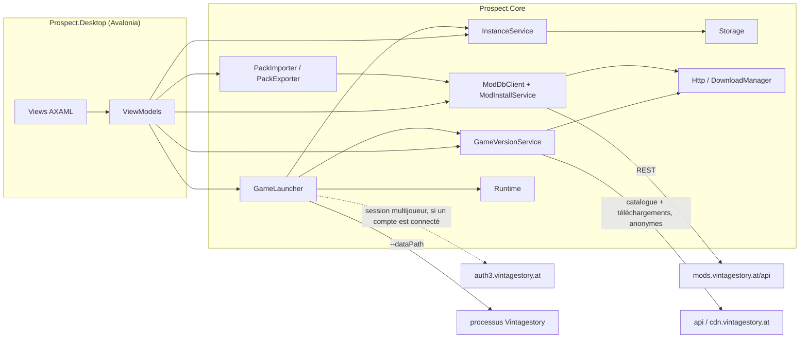
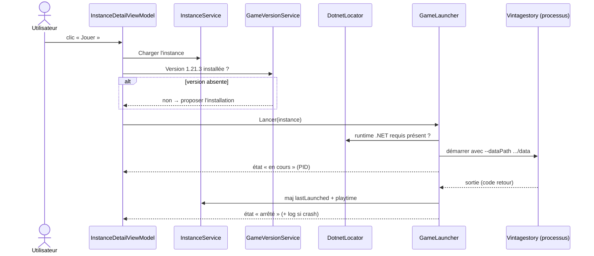

# Prospect : architecture proposée

Statut : proposition du 2026-08-10, en attente de validation. Rien de ce document n'est
implémenté. Les points marqués « à confirmer » renvoient aux documents de recherche
dans [docs/research/](research/).

Prospect est un launcher pour Vintage Story dans l'esprit de Prism Launcher : des
instances isolées (un dossier = une version du jeu, des mods, des configs, des mondes),
un catalogue de versions du jeu installées côte à côte, et un client du ModDB officiel.
VS Launcher, la référence communautaire, est archivé depuis juin 2026. Vintage Story
supporte nativement `--dataPath`, ce qui rend l'isolation d'instances triviale côté jeu :
tout le travail est côté launcher.

## Principes

Le cœur du projet est la séparation stricte entre logique et interface. Tout ce qui se
teste vit dans `Prospect.Core`, un projet .NET sans la moindre référence à Avalonia.
L'interface (`Prospect.Desktop`) n'est qu'une peau MVVM par-dessus : des ViewModels
minces qui appellent les services du Core. Cette frontière n'est pas négociable, c'est
elle qui rend le TDD praticable et qui permet d'intégrer le design fourni par Claude
Design (déjà livré, conservé hors dépôt dans `design/` en local) sans toucher à la
logique.

Deuxième principe : le système de fichiers est la source de vérité. Pas de base de
données. Une instance existe parce que son dossier existe, un mod est installé parce que
son zip est dans `Mods/`. L'utilisateur peut intervenir à la main dans les dossiers sans
casser le launcher, qui rescanne au lieu de faire confiance à un état interne. Prism
fonctionne comme ça depuis des années et c'est ce qui le rend robuste.

## Décisions structurantes

**Cible `net10.0`.** La contrainte du projet est « .NET 8+ ». .NET 8 sort de support en
novembre 2026, dans trois mois. .NET 10 est le LTS courant, le SDK 10.0.110 est déjà
installé sur la machine de dev, et Avalonia 11.3 le supporte. Partir sur .NET 8
aujourd'hui, c'est planifier une migration avant même la première release.

**Deux projets source, pas quatre.** Pas de découpage Domain / Application /
Infrastructure : sur un launcher solo en MVP, ces couches coûtent plus qu'elles ne
rapportent. `Prospect.Core` contient tout, organisé en dossiers par domaine métier, avec
des interfaces là où la testabilité l'exige (système de fichiers, HTTP, horloge). Si un
domaine grossit au point de le justifier, on extraira un projet à ce moment-là.

**Testabilité par abstraction des effets de bord.** `System.IO.Abstractions` pour le
système de fichiers (les tests utilisent `MockFileSystem`, aucun fichier réel), des
`HttpMessageHandler` factices pour le réseau, une interface `IClock` pour le temps. Les
services du Core reçoivent tout par injection (constructeurs), conteneur
`Microsoft.Extensions.DependencyInjection` composé dans l'app.

**Sérialisation `System.Text.Json` avec source generators.** Pas de Newtonsoft. Les
schémas (instance.json, manifests, réponses API) sont des records C# annotés, le
générateur de source évite la réflexion et prépare un éventuel AOT.

**Résilience réseau adaptée au streaming.** Les téléchargements (fichiers du jeu, mods)
utilisent une reprise maison : réessais bornés avec backoff, bascule de miroir, reprise
par en-tête `Range`, et un timeout d'inactivité par lecture plutôt qu'un délai total par
requête, qu'un transfert de 600 Mo sur une ligne lente violerait mécaniquement. Décision
entérinée à la PR 16 : les handlers de résilience standard imposent précisément ce délai
total et n'ont aucune notion de miroir. Les appels API courts (catalogue, ModDB) peuvent
en revanche porter une politique de retry classique.

**Stack de test : xUnit + NSubstitute + coverlet.** NSubstitute plutôt que Moq
(l'épisode SponsorLink a suffi). Pour les assertions, FluentAssertions est devenu payant
en v8 ; je propose Shouldly, ou les asserts xUnit nus si tu préfères zéro dépendance.
Point ouvert n° 3.

**UI : Avalonia 11.3, CommunityToolkit.Mvvm, bindings compilés** (`x:DataType` partout,
`AvaloniaUseCompiledBindingsByDefault`). Navigation maison légère : un `ShellViewModel`
qui expose la page courante, pas de framework de navigation tiers.

## Patterns de conception

Les patterns attendus, par famille, pour que chaque PR les applique et que la review
les vérifie. La règle générale : de petits objets cohérents, composés par injection de
constructeur, jamais d'état statique muable, jamais de service locator.

**Value objects immuables** pour tout ce qui est une valeur : `GameVersion`,
`ModVersion`, `VersionRequirement`, plus tard les identifiants. Égalité structurelle,
comparateurs explicites, sérialisation par converter dédié.

**Ports et adaptateurs, version pragmatique** : chaque effet de bord passe par une
interface injectée (`IFileSystem`, `IClock`, `IAppEnvironment`, `HttpMessageHandler`
factice en test, `ISecretStore` plus tard). La logique ne touche jamais le monde
directement, c'est ce qui rend le TDD réel.

**Repository** pour la persistance scannée : `IInstanceRepository`,
`IGameVersionRepository`. Le système de fichiers est la base de données, le repository
est le seul à connaître sa topologie.

**Services applicatifs par domaine** (`InstanceService`, `GameInstallService`,
`GameLauncher`, `ModInstallService`...) : la façade que consomment les ViewModels. Un
ViewModel ne compose jamais de logique métier à partir de briques plus basses.

**Strategy par OS** pour tout ce qui diverge entre plateformes : installation du jeu
(installeur Inno silencieux contre tar.gz + chmod), commande de lancement, chemins.
Une interface, une implémentation par plateforme, sélection à la composition, jamais
de `if (OperatingSystem.IsWindows())` disséminés dans les services.

**Progression et état observables** : `IProgress<T>` et évènements pour les
téléchargements et le cycle de vie du processus de jeu ; `CancellationToken` sur toute
opération longue, sans exception.

**Pipeline de migrations** ordonné pour les schémas versionnés (instance.json,
prospect.json) : une migration = une classe testée, appliquées en chaîne au chargement.

**MVVM strict** côté Desktop : CommunityToolkit.Mvvm, bindings compilés, zéro logique
en code-behind, ViewModels constructibles sans UI.

Les erreurs attendues du domaine sont des exceptions typées du projet (jamais
d'`Exception` nue), et les cas « absence normale » (fichier pas encore créé) sont des
retours nullables, pas des exceptions.

**Journal de diagnostic transverse.** `IAppLog` (`Common/`) traverse presque tous les services :
un défaut rapporté depuis une machine d'utilisateur ne se diagnostique que sur pièce, et ce qui s'y
écrit sont les FAITS d'une session — catalogue relu, téléchargement commencé et fini avec sa taille,
version installée ou retirée, instance créée, dupliquée ou supprimée, lancement avec son pid et
sortie avec son code, mod posé, remplacé, activé ou retiré, vérification de mises à jour avec son
verdict compté, et toute erreur montrée à l'utilisateur. Jamais un secret, et jamais une ligne à la
fréquence d'une boucle : un téléchargement journalise ses deux bouts, pas ses mille rapports
d'avancement. C'est le seul port du projet qui s'autorise un paramètre de constructeur optionnel, en
dernière position, avec `NullAppLog.Instance` pour repli — requis là où il est une raison d'être du
service, optionnel là où il a été ajouté en nombre à des services que les tests construisent par
dizaines. L'arbitrage est argumenté sur l'interface elle-même et gardé par `AppLogWiringTests`, qui
vérifie que le conteneur livre bien un vrai `FileAppLog` à chacun de ces services.

Une seule exception à « jamais d'état statique muable » est admise, et elle est nommée ici
pour qu'elle reste unique : `Prospect.Desktop.Resources.UiText`, la table de textes de la
langue choisie, fixée une fois au démarrage avec une garde qui refuse toute deuxième
fixation (voir « Langue de l'interface »).

## Solution et arborescence

```
Prospect/
├── Prospect.sln
├── global.json                    # SDK 10.0.1xx épinglé, rollForward latestFeature
├── Directory.Build.props          # nullable, TreatWarningsAsErrors, analyzers, version
├── Directory.Packages.props       # gestion centralisée des versions de paquets
├── .editorconfig
├── .github/workflows/ci.yml
├── src/
│   ├── Prospect.Core/             # logique métier, zéro référence UI
│   └── Prospect.Desktop/          # Avalonia, MVVM, composition root
├── tests/
│   ├── Prospect.Core.Tests/       # xUnit, la cible de coverage
│   └── Prospect.Desktop.Tests/    # Avalonia.Headless, smoke tests (léger au début)
└── docs/
    ├── architecture.md            # ce document
    ├── adr/                       # décisions notables, une page par décision
    └── research/                  # documents d'exploration (API ModDB, VS Launcher)
```

`Prospect.Core` s'organise par domaine, un dossier = un namespace :

```
Prospect.Core/
├── Common/          # GameVersion et ModVersion (parsing, comparaison), erreurs, IClock
├── Storage/         # AppPaths (XDG/AppData), JsonFileStore (écritures atomiques), settings
├── Instances/       # modèle Instance, InstanceService (CRUD), scan du dossier instances/
├── GameVersions/    # catalogue distant, installations locales, téléchargement, extraction
├── Runtime/         # détection du runtime .NET requis par le jeu
├── Auth/            # session compte vintagestory.at pour le multijoueur (client, ISecretStore)
├── Launching/       # construction de la ligne de commande, suivi du processus, playtime
├── ModDb/           # client API, recherche, installation, provenance, détection de MàJ
├── Modpacks/        # manifest, export, import
└── Http/            # DownloadManager partagé (progression, annulation, checksum)
```

La dépendance entre domaines va dans un seul sens : `ModDb`, `GameVersions` et
`Modpacks` s'appuient sur `Http` et `Storage` ; `Launching` s'appuie sur `Instances`,
`GameVersions` et `Runtime` ; personne ne dépend de `ModDb` sauf `Modpacks`. `Common` et
`Storage` ne dépendent de rien.



## Modèle de données

### Arborescence disque

Tout vit sous une racine unique, relocalisable dans les réglages. Par défaut :
`$XDG_DATA_HOME/prospect` sur Linux (soit `~/.local/share/prospect`),
`%APPDATA%\Prospect` sur Windows, `~/Library/Application Support/Prospect` sur macOS.

```
prospect/
├── prospect.json                  # réglages globaux
├── instances/
│   └── homestead-121/             # slug dérivé du nom, unique
│       ├── instance.json          # métadonnées, hors de portée du jeu
│       ├── prospect-mods.json     # provenance ModDB des mods installés (cache)
│       └── data/                  # la cible de --dataPath
│           ├── Mods/              # les .zip des mods
│           ├── ModConfig/
│           ├── Saves/
│           └── ...                # le jeu écrit ce qu'il veut ici
├── versions/
│   ├── 1.21.3/                    # une installation complète du jeu
│   └── 1.20.12/
├── cache/
│   ├── downloads/                 # archives en cours ou terminées
│   └── http/                      # cache léger des réponses ModDB
└── logs/
```

Le point important : `instance.json` est à côté de `data/`, pas dedans. Le jeu écrit
librement dans son dataPath (clientsettings.json, logs, etc.) et ne doit jamais pouvoir
entrer en collision avec nos métadonnées.

### instance.json (schéma v1)

```json
{
  "schemaVersion": 1,
  "id": "0c9c1f57-8b2e-4f2a-9c41-3d8a12f7b6e0",
  "name": "Homestead 1.21",
  "gameVersion": "1.21.3",
  "icon": "builtin:default",
  "createdUtc": "2026-08-10T14:00:00Z",
  "lastLaunchedUtc": null,
  "totalPlaytimeSeconds": 0,
  "launch": {
    "extraArgs": [],
    "env": {}
  },
  "notes": ""
}
```

Choix qui méritent une ligne d'explication :

`id` est un GUID immuable : renommer l'instance change `name` et éventuellement le slug
du dossier, jamais l'identité. `icon` vaut `builtin:<nom>` pour les icônes embarquées ou
`file:icon.png` pour un fichier copié dans le dossier de l'instance. `schemaVersion`
existe dès le premier jour, avec une chaîne de migrations testée au chargement : c'est
beaucoup moins cher maintenant que dans six mois.

La liste des mods n'est volontairement pas ici. La vérité, ce sont les zips dans
`data/Mods/` : le joueur peut en déposer à la main, le launcher rescanne et parse les
`modinfo.json`. Ce qu'on garde à part, dans `prospect-mods.json`, c'est la provenance de
ce que nous avons installé (modid ModDB, fileid, version au moment de l'installation)
pour rendre la détection de mises à jour exacte. Ce fichier est un cache : le supprimer
dégrade l'expérience (on retombe sur la correspondance par modid), il ne casse rien.

### prospect.json (réglages globaux, v1 minimale)

Langue de l'UI (`fr` ou `en`, voir « Langue de l'interface » plus bas), fond de fenêtre (clé du
`BackdropCatalog`, voir « Fond de fenêtre »), chemin racine si déplacé, préférences de
téléchargement (parallélisme), et la référence de session du compte vintagestory.at (jamais le mot
de passe, voir plus bas). Tout le reste attendra d'exister.

### Manifest de modpack (prospect-pack.json, v1)

```json
{
  "schemaVersion": 1,
  "name": "Pack exemple",
  "author": "Pixnop",
  "gameVersion": "1.21.3",
  "mods": [
    { "modId": "carrycapacity", "version": "1.8.0", "fileId": 12345, "sha256": null }
  ]
}
```

Chaque entrée de `mods` porte aussi un champ optionnel `enabled` (omis quand vrai,
ajouté au schéma à la PR 22) : les mods désactivés d'une instance voyagent avec leur
état. Les `sha256` sont calculés par Prospect à l'export depuis les zips locaux, le
ModDB n'exposant aucune somme de contrôle, et vérifiés à l'import quand ils sont
présents ; un écart isole l'échec au mod concerné sans faire tomber l'import.

L'export produit ce fichier (seul ou zippé avec, en option, le dossier `ModConfig/` de
l'instance). L'import crée une instance, installe la version du jeu si absente, résout
chaque mod via le ModDB (par `modId` + `version`, `fileId` en raccourci quand il est
encore valide) et produit un rapport listant ce qui n'a pas pu être résolu. Le manifest
reste portable : aucune URL signée, aucun chemin absolu.

## Les domaines du Core, dans l'ordre du MVP

### 1. Instances

`InstanceService` : créer (nom → slug unique, écriture de `instance.json`, création de
`data/`), dupliquer (copie récursive de `data/` avec progression et annulation, nouveau
GUID), renommer, supprimer (après confirmation côté UI ; suppression définitive en MVP),
lister (scan de `instances/*/instance.json`, les dossiers illisibles remontent comme
« instances cassées » au lieu de faire planter le scan).

L'écran de détail maquetté par le design ajoute deux besoins légers ici : lister les
mondes d'une instance (scan de `data/Saves/`, nom, taille, date) et exposer son journal
(le log du dernier lancement). Autant les prévoir dans le domaine que les découvrir en
branchant l'UI.

### 2. Versions du jeu

La recherche ([research/vslauncher-et-distribution.md](research/vslauncher-et-distribution.md))
a tranché la question qui conditionnait tout ce domaine : le téléchargement du jeu est
entièrement public. Le catalogue vit sur `https://api.vintagestory.at/stable.json` et
`unstable.json` (API qualifiée de publique par ses mainteneurs), et les fichiers sont
servis anonymement par un CDN BunnyCDN plus un miroir nginx, vérifié en live. **L'auth
compte sort donc du MVP**, voir la section post-MVP.

Le catalogue donne, par version puis par plateforme (`windows`, `linux`, `mac-x64`,
`mac-arm64`, plus les serveurs) : `filename`, `filesize` (chaîne humaine du type
« 590.5 MB », pas des octets), `md5`, deux miroirs `urls.cdn` et `urls.local`, et un
flag `latest`. Les canaux se déduisent du nom de version (`-rc.N`, `-pre.N`), pas d'un
champ dédié.

Deux repositories : le catalogue distant et les installations locales (scan de
`versions/`, un fichier sentinelle `.prospect-complete` écrit en fin d'installation pour
détecter les installations interrompues). `GameInstallService` orchestre :
téléchargement dans `cache/downloads/` via le `DownloadManager` avec repli automatique
sur le second miroir, vérification du md5 annoncé (VS Launcher exposait ce champ sans
jamais le vérifier, on fera mieux pour trois lignes de code), puis une stratégie
d'installation par OS :

- Linux et macOS : extraction du `.tar.gz`, puis restauration explicite des bits
  d'exécution (`chmod 755` récursif) car l'extraction ne les préserve pas et le binaire
  natif `Vintagestory` ne se lance pas sans ça ;
- Windows : il n'existe pas de build portable, uniquement un installeur Inno Setup. On
  reprend le pattern éprouvé de VS Launcher : exécution silencieuse avec
  `/VERYSILENT /SUPPRESSMSGBOXES /NORESTART /CURRENTUSER /NOICONS /DIR=<versions/X.Y.Z>`.

#### La boîte « ancienne version détectée » : ce qu'on ne peut pas empêcher

Une installation Windows silencieuse ouvre quand même une fenêtre, et il faut le dire une
fois pour toutes : la question « une ancienne version a été détectée, la désinstaller
d'abord ? » ne vient pas de Setup, elle vient du SCRIPT propre à l'installeur de Vintage
Story, qui lit le registre pour détecter une installation classique du jeu. Or
`/SUPPRESSMSGBOXES` ne couvre que les messages de Setup lui-même et la fonction
`SuppressibleMsgBox` du langage de script ; un `MsgBox` nu appelé depuis `InitializeSetup`
s'affiche quel que soit le drapeau (documentation Inno Setup, « Setup Command Line
Parameters » et « Pascal Scripting: SuppressibleMsgBox »). Aucun argument ne la couvre, et
il n'y a rien à corriger de notre côté.

Deux conséquences, toutes deux contre-intuitives et toutes deux vérifiées.

Cette boîte apparaîtra à CHAQUE installation tant qu'un Vintage Story classique est
enregistré sur la machine. Ce n'est pas le signe d'une désinstallation ratée ni d'une
installation précédente restée à moitié : c'est une détection en registre qui refait son
travail, et elle le refera à chaque fois.

Et son bouton par défaut est « Oui », c'est-à-dire DÉSINSTALLER le jeu de l'utilisateur.
Une touche Entrée réflexe emporte une installation qui n'a rien demandé. C'est pour ça que
Prospect prévient AVANT plutôt que d'expliquer après : sous Windows uniquement, dès l'entrée
dans la phase d'installation, l'écran Versions et le wizard affichent une notice qui dit quoi
répondre (`UiText.Versions.InstallerPromptNotice`, la règle d'affichage étant dans
`GameInstallProgressPresenter.ShowsInstallerPromptNotice`). Pas de case « ne plus afficher » :
la question est dangereuse à chaque fois, donc l'avertissement l'accompagne à chaque fois.

Le garde-fou qui reste est celui du RÉSULTAT : `GameInstallService` vérifie qu'un exécutable
attendu se trouve bien dans le dossier de la version avant d'écrire la sentinelle de
complétude. Voir cette boîte n'est donc pas une preuve que les arguments ne sont pas arrivés,
et une installation détournée ailleurs ne peut pas se faire passer pour réussie.

#### Progression de l'installeur silencieux : une estimation assumée

`/VERYSILENT` ne publie aucun avancement et le processus ne rend la main qu'à la fin, donc
il n'y a rien à lire. Ce qu'il fait en revanche, c'est écrire ses fichiers PROGRESSIVEMENT
dans le dossier passé à `/DIR`, et cette taille cumulée est observable :
`InstallDirectoryGrowthReporter` l'échantillonne à la seconde à travers `IFileSystem` et
publie un ratio contre une taille attendue.

La taille attendue est déduite du seul chiffre exact dont on dispose, la taille de l'exécutable
téléchargé, multipliée par un facteur d'expansion de 1,8 (l'installeur est une archive LZMA,
le contenu déposé pèse plus lourd). Le facteur est choisi du côté prudent : le surestimer fait
terminer la barre un peu court avant qu'elle ne saute à 100 %, le sous-estimer la collerait au
plafond pendant la moitié de l'installation. Il se recale d'une mesure réelle sous Windows, en
comparant le dossier de version au `.exe` correspondant dans `cache/downloads/`.

Trois garde-fous rendent l'estimation honnête même avec un dénominateur faux : la progression
est MONOTONE (un échantillon plus bas ne fait jamais reculer la barre), elle est PLAFONNÉE à
99 % tant que le processus n'a pas rendu 0, et elle est ÉTIQUETÉE comme estimation dans le
libellé (« installation · ~42 % » contre « extraction · 42 % » pour la mesure exacte de
Linux et macOS, qui elle ne change pas). Faute de taille d'installeur lisible, il n'y a pas
d'estimation du tout et la phase reste franchement indéterminée : inventer un dénominateur
serait inventer un pourcentage.

#### Désinstaller : hors du thread d'interface, et en comptant

Effacer une installation (six cents mégaoctets) ou une instance (des gigaoctets de mondes) est
une opération longue, et `System.IO.Abstractions` est synchrone de bout en bout : un `await` sur
un appel synchrone ne déporte rien, il rend la main sur un travail déjà fait. Les deux chemins
passent donc par un `Task.Run` assumé, et par le même `DirectoryDeleter` (`Storage/`), qui relève
les fichiers AVANT de les effacer. Compter est rapide, effacer ne l'est pas : c'est ce qui donne
un dénominateur, donc une barre déterminée plutôt qu'un rond qui tourne, publiée en
`IProgress<DirectoryDeleteProgress>` comme le reste du Core.

Les deux dialogues concernés restent ouverts et vivants pendant l'opération, leurs boutons hors
service, sans annulation offerte : une version ou une instance à moitié supprimée est pire que
les deux états francs. Un échec partiel remonte typé (`DirectoryDeleteFailedException`, retraduit
en `InstanceDeleteFailedException` côté instances) et le dialogue nomme le dossier où il reste
des fichiers.

La désinstallation d'un MOD ne relève pas de ce dispositif et n'en a pas besoin : c'est la
suppression d'un seul zip, qui rend la main immédiatement.

macOS est traité comme une cible réelle dès le modèle (téléchargement et extraction des
builds `mac-arm64`/`mac-x64` fonctionnels), même si le bouton « Jouer » mac attendra une
vraie machine de test : VS Launcher a laissé ses utilisateurs mac des années avec un
« not yet supported » faute d'avoir anticipé.

### 3. Lancement

La commande est confirmée par la recherche : sur Linux on exécute le binaire natif
`<versions/X.Y.Z>/Vintagestory` avec `--dataPath=<chemin absolu vers data/>`, sur
Windows `Vintagestory.exe` avec les mêmes arguments. `GameLauncher` valide (version
installée ? runtime présent ?), construit la commande via
`ProcessStartInfo.ArgumentList` (les `extraArgs` de l'instance sont une vraie liste,
jamais une chaîne collée : VS Launcher passait les paramètres utilisateur comme un seul
argv et c'était fragile), injecte les variables d'environnement de l'instance (utile
par exemple pour `mesa_glthread=true` sur Linux), démarre le processus, capture
stdout/stderr vers `logs/instance-<slug>.log`, suit l'état (une instance en cours ne se
relance pas) et met à jour `lastLaunchedUtc` et le playtime à la sortie.

`Runtime/` détecte le .NET du système (`dotnet --list-runtimes`) et le compare au requis
de la version du jeu (table dans le Core : les versions récentes du jeu s'étalent sur
.NET 7, 8 ou 10 selon la version). C'est un vrai différenciateur : VS Launcher ne
faisait aucune détection, sa doc demandait d'installer les trois majors à la main et ses
mainteneurs listaient ce point comme une friction jamais résolue. En MVP on ne
télécharge pas de runtime, on diagnostique et on explique précisément quoi installer ;
l'interface `IDotnetLocator` laisse la porte ouverte à un runtime géré façon Prism/Java
après le MVP.

#### Lire le journal de lancement

Le journal capturé sert déjà à un onglet qui l'affiche. Il sert maintenant aussi à
répondre à deux questions que l'utilisateur pose autrement : quel mod a posé problème au
dernier lancement, et quels mods se parlent entre eux. `GameLogAnalyzer` (Core,
`Diagnostics/`) le lit et rend, PAR MOD, un décompte d'erreurs et d'avertissements avec
deux ou trois lignes en exemple, plus les références inter-domaines qu'il a vues passer.
C'est du calcul pur : des lignes entrent, un rapport sort, rien n'est écrit.

Les formes reconnues viennent d'une session réelle (client et serveur 1.22.6, journaux
relevés pendant l'implémentation), pas d'une spécification. Le moteur écrit
`13.8.2026 22:12:06 [Server Error] <message>` sur sa sortie standard, celle que Prospect
capture, et `[Error]` sans côté dans ses propres fichiers ; les deux se lisent. Une ligne
sans entête est rattachée à l'entrée précédente si elle est indentée, ce qui est le cas
des trames d'une pile d'exception, et ignorée sinon, ce qui écarte aussi bien l'entête
que Prospect écrit en tête de journal que le bavardage d'une bibliothèque native.

L'attribution suit quatre marques, de la plus fiable à la plus indirecte. Le chargeur de
mods préfixe lui-même ses messages du `modid` concerné (`[carryon] …`), ou du nom
d'archive quand le `modinfo.json` n'a pas pu être lu (`[monmod-1.0.0.zip] …`), et c'est
la seule marque que le moteur écrit dans l'intention de désigner un mod. Les messages du
chargeur de patches JSON portent le domaine du mod qui a écrit le patch
(`Patch 2 in carryon:patches/x.json …`). Le bloc « Started N systems on … » relie chaque
mod à ses noms de types (`Mod 'carryon-2.0.0-pre.8.zip' (carryon):` suivi de
`CarryOn.CarrySystem`), ce qui rattache ensuite les exceptions qui les nomment. À défaut,
un segment de nom de type qui est exactement un `modid` connu suffit, le segment le plus
long gagnant : `CarryOn.CarryOnLib.CarryOnLibSystem` appartient à `carryonlib`, pas à
`carryon`.

Ce que l'analyse ne sait PAS faire mérite d'être écrit plutôt que découvert. Une ligne
qu'un mod écrit LUI-MÊME par l'API du jeu n'est marquée nulle part comme venant de lui
(vérifié : `api.Logger.Notification` ne préfixe rien), elle reste donc non attribuée sauf
si le mod a pris soin de se nommer en tête de son message, ce que certains font. Un patch
appliqué avec succès ne laisse aucune ligne, donc le journal ne peut pas prouver qu'une
intégration FONCTIONNE, seulement qu'une référence a échoué : c'est l'analyse statique du
zip qui complète. Et seules les premières `MaxLines` lignes sont lues, parce que c'est le
DÉBUT du journal qui décrit le lancement.

L'analyse est déclenchée à la sortie du jeu et à l'ouverture de l'onglet Mods, et le
résultat est mémorisé par slug pour la session (`IGameLogInsightsCache`, côté Desktop).
Rien n'est persisté, et pour une raison plus forte que pour le cache de mises à jour : le
JOURNAL est déjà la persistance, il survit à la fermeture de Prospect et il est réécrit à
chaque lancement. Deux évènements invalident la lecture, le lancement suivant (qui tronque
le journal, donc les pastilles disparaissent au clic sur Jouer plutôt qu'à la sortie) et la
suppression de l'instance (`DeletedInstanceStateCleaner`, où le slug redevient libre).

### 4. Client ModDB

`ModDbClient` est un client REST typé sur `mods.vintagestory.at/api`, dont le schéma
réel est documenté dans [research/moddb-api.md](research/moddb-api.md) (croisement du
code PHP du site et d'appels live). Trois particularités structurent le client. Il n'y
a aucune pagination : `/api/mods` renvoie le catalogue entier (7 994 mods, 3,5 Mo) en
un appel, donc on le met en cache local avec un TTL et la recherche filtre en mémoire.
Sur l'API v1, le code HTTP ment : les erreurs applicatives arrivent en HTTP 200 avec un
champ JSON `statuscode` (une chaîne), donc l'enveloppe de désérialisation lit ce champ
au lieu de faire confiance à `IsSuccessStatusCode`. Et les DTOs sont défensifs : champs
souvent `null` (`logo`, `urlalias`), `tagid` de version de jeu en `long`, dates tantôt
chaînes SQL tantôt timestamps Unix selon la génération d'endpoint. `ModInstallService` télécharge le zip
d'une release dans `data/Mods/` sous le nom `<modid>-<version>.zip` (la convention de
VS Launcher, lisible et stable) et enregistre la provenance. La désinstallation supprime
le zip. L'activation/désactivation sans suppression est un renommage (`.zip` →
`.zip.disabled`), à valider par un test réel du jeu en début d'implémentation ; VS
Launcher n'offrait aucun mécanisme de ce genre, c'est un manque documenté qu'on comble.

Attention au parsing des `modinfo.json` : dans la nature, la casse des clés varie
(`modid`, `Modid`, `ModID`...) et les fichiers contiennent parfois commentaires et
virgules terminales (VS Launcher les parsait en JSON5). Notre `ModInfoParser` sera
tolérant : `System.Text.Json` avec `JsonCommentHandling.Skip`, `AllowTrailingCommas` et
une résolution de clés insensible à la casse, plus des tests nourris d'échantillons
réels collectés pendant la recherche.

La détection de mises à jour s'appuie sur `/api/updates?mods=a@v1,b@v2` : un seul appel
pour tous les mods installés, qui ne renvoie que ceux en retard, avec leurs releases et
les versions de jeu taguées. Deux subtilités sorties de la recherche. Les tags de
compatibilité d'une release sont des cases cochées à la main par l'auteur sur le site,
jamais recalculées depuis le modinfo.json : des oublis arrivent, donc l'UI proposera un
mode « élargir à la même série 1.21.x », clairement signalé comme approximatif. Et
l'absence d'un mod dans la réponse ne distingue pas « à jour » de « inconnu du ModDB » :
on compare aux clés envoyées. L'endpoint v2 `install-information`, qui raisonne par
version de jeu cible, est une piste plus riche à évaluer pendant l'implémentation.

Les contraintes de version des `dependencies` du modinfo.json sont des bornes minimales
(comparaison `>=` sémantique, `""` ou `"*"` pour « toute version »), pas des versions
exactes ni des wildcards `1.20.*` : cette syntaxe n'existe nulle part, la recherche l'a
établi contre le wiki, la doc de l'assembly du jeu et des échantillons réels. Notre type
`ModVersion` implémente donc parsing `X.Y.Z[-dev|pre|rc.N]`, ordre
`dev < pre < rc < stable` et comparaison `>=`. Du pur calcul, écrit en TDD strict dès la
PR des fondations, nourri des échantillons collectés.

Dépendances et compatibilité entre mods, en trois niveaux du sûr vers l'heuristique.

**Dépendances déclarées** (l'objet `dependencies` du modinfo.json). À l'installation
d'un mod, résolution transitive : les dépendances manquantes sont détectées (croisement
du `resolve-deps` de `/api/v2/mods/install-information` et d'une vérification locale
contre les zips installés) et proposées à l'installation en un clic, jamais installées
en silence. À la désinstallation et à la mise à jour, vérification inverse : si retirer
ou monter B casse la contrainte d'un mod A installé, l'action nomme A avant de demander
confirmation. Les identifiants spéciaux `game`, `survival` et `creative` sont traités à
part, comme le fait le ModDB lui-même (`game` alimente la compatibilité de version de
jeu, les deux autres sont ignorés).

**Compatibilité de version de jeu** : le croisement déjà décrit plus haut, tags
éditoriaux de release côté ModDB et `dependencies.game` du modinfo, rendu par le badge
de canal `incompatible` du design.

**Intégrations non déclarées** (fait) : réalité du modding VS, des mods en référencent
d'autres sans dépendance déclarée, typiquement des patches JSON ciblant les assets d'un
autre `modid:` ou des intégrations conditionnelles. Deux sources, l'une observée et
l'autre annoncée, décrites en détail dans « Lire le journal de lancement » plus bas : ce
que le JEU a écrit dans le journal du dernier lancement, et ce que le ZIP installé
contient. Du zip, `ModIntegrationScanner` lit les fichiers de patch et leurs cibles :
une cible étrangère sous marqueur conditionnel (`dependsOn`) est une intégration
optionnelle, une cible étrangère sans condition est une dépendance probablement
oubliée. Du journal viennent les références que le moteur a REFUSÉ de résoudre, et
c'est le seul des deux signaux qui prouve quelque chose : un patch appliqué avec succès
ne laisse aucune ligne, seulement un total en fin de chargement.

Le résultat est strictement informatif, jamais bloquant : la ligne du mod porte une
pastille neutre « fonctionne avec X » quand la cible est installée, ou « attend du
contenu de X » quand elle manque. L'heuristique ne distingue pas l'intégration
volontaire de l'oubli, et les dépendances de code (références d'assembly) restent hors
de portée. C'est assumé ici plutôt que promis à l'utilisateur : une intégration non
détectée n'est pas une intégration absente.

### 5. Modpacks

Décrit plus haut avec le manifest. L'import réutilise tout l'existant (création
d'instance, installation de version, installation de mods) : c'est le test d'intégration
naturel de l'ensemble du Core.

**Machinerie Core en place, surface UI retirée en attendant la réflexion produit.**
`Prospect.Core/Modpacks` reste entier et testé : manifeste, sérialiseur,
`ModpackExportService`, `ModpackImportService`, leurs exceptions et leurs tests. Ce qui a
été retiré est ce que l'utilisateur pouvait atteindre : le bouton « Importer un modpack »
de l'accueil, l'action « Exporter » du détail d'instance, les deux dialogues
(`ExportModpackDialogView`, `ImportModpackView`) et leurs ViewModels, leurs clés de
chaînes dans les deux langues, et l'enregistrement des deux services Core dans
`CompositionRoot`.

La raison est produit, pas technique : on y réfléchira mieux plus tard, quand le launcher
sera vraiment fonctionnel. Partager un pack pose des questions qu'aucun bouton ne tranche
tout seul (que fait-on d'un mod retiré du ModDB, d'une version de jeu disparue, d'un pack
dont l'auteur n'a jamais testé la combinaison), et il vaut mieux les poser une fois le
reste solide. Remettre l'interface tiendra en quelques écrans branchés sur des services
qui n'auront pas bougé ; c'est précisément pour ça que le Core reste là plutôt que d'être
supprimé et réécrit.

### Transverse : téléchargements

Un seul `DownloadManager` pour le jeu et les mods : file de téléchargements,
`IProgress<DownloadProgress>` (octets, total, vitesse), `CancellationToken` partout,
reprise sur erreur réseau via la politique de résilience, vérification de checksum
quand la source en fournit. L'UI « Téléchargements » n'est qu'une vue sur cette file.



## UI Avalonia et design system

Le design est déjà livré : le handoff Claude Design vit dans `design/`, en local et
volontairement hors dépôt (tokens CSS, 26 composants de référence, guidelines, et un
ui_kit qui maquette la fenêtre complète écran par écran, à 1280×800). Les agents
d'implémentation UI le lisent sur cette machine ; le dépôt public n'en contient que la
transposition Avalonia. Il a été conçu pour Avalonia : couleurs
plates, ombres simples transposables en `BoxShadow`, hauteurs de contrôles fixes, aucun
blur, aucune animation exotique. Le travail UI n'est donc pas de créer un design mais
de transposer fidèlement celui-là.

La structure des vues suit les écrans du ui_kit :

```
Prospect.Desktop/
├── App.axaml / App.axaml.cs       # composition root : DI, thèmes
├── Views/ et ViewModels/
│   ├── Shell                      # titlebar custom 38px, sidebar 216px, popover téléchargements, toasts
│   ├── Home                       # grille d'instances, recherche/tri, état vide
│   ├── Instance                   # détail : onglets Mods / Mondes / Journal / Options
│   ├── ModBrowser                 # recherche ModDB, filtres, fiche mod, mode hors-ligne
│   ├── Versions                   # canaux, installées vs disponibles, progression
│   ├── Wizard                     # création d'instance en 4 étapes
│   ├── Settings                   # Général / Jeu / Réseau / Comptes / À propos
│   └── FirstRun                   # checklist de premier lancement
├── Services/                      # DialogService, StorageProvider (pickers)
├── Styles/
│   ├── Tokens/                    # port 1:1 de design/tokens/*.css en ResourceDictionary
│   └── Controls/                  # ControlThemes : Button, Input, Badge, InstanceCard...
└── Assets/                        # logo, icône d'app, polices, géométries d'icônes
```

Le port des tokens est mécanique, et c'est voulu : chaque variable CSS
(`--copper-500`, `--bg-surface`, `--channel-stable`...) devient une ressource Avalonia
du même nom, thème sombre par défaut et variante claire via les `ThemeVariant`. Les
trois polices (IBM Plex Sans, IBM Plex Mono, Space Grotesk, toutes SIL OFL) s'embarquent
en ressources ; les ~34 icônes Lucide inlinées dans le design se portent en géométries
`PathIcon`. Le vocabulaire des canaux du design (`stable`, `unstable`, `pre`,
`incompatible`) mappe exactement notre modèle de versions.

Deux points de vigilance relevés à la lecture du handoff. La titlebar custom (38 px,
fenêtre sans décorations système) est simple sur Windows mais sensible sous
Linux/Wayland : la PR du shell devra trancher entre décorations client partout ou repli
sur la barre native selon la plateforme. Et les quatre états système maquettés (nominal,
aucune instance, ModDB injoignable, premier lancement) sont des états de ViewModel à
modéliser dès le début, pas des écrans à rajouter après coup.

### Décorations de fenêtre : la recette qui marche

Le chemin « barre de titre maison » demande TROIS propriétés ensemble sur `MainWindow`,
et non deux :

| Propriété | Valeur | Pourquoi |
|---|---|---|
| `ExtendClientAreaToDecorationsHint` | `true` | La zone client couvre la bande de légende. |
| `ExtendClientAreaChromeHints` | `NoChrome` | **La plus importante.** Sa valeur par défaut est `Default`, qui est un alias de `PreferSystemChrome` (métadonnées d'Avalonia 11.3.20 : propriété enregistrée avec la valeur 2). Ne pas l'écrire revient à demander au système de dessiner SA barre de titre par-dessus la nôtre — c'est exactement le défaut de double barre observé sur Windows. |
| `ExtendClientAreaTitleBarHeightHint` | `38` | La bande que le système considère comme légende (déplacement, accrochage) doit coïncider avec notre `TitlebarView`, dimensionnée par le jeton `TitlebarH`. |

La quatrième propriété, `SystemDecorations`, est la seule qui DIVERGE par système, et
c'est le seul point où la recette n'est pas la même partout.

Sous Windows et macOS elle vaut `Full`. `BorderOnly` ne masque aucun chrome, il retire
seulement le cadre non client sur lequel Windows appuie l'ombre, les poignées de
redimensionnement et l'accrochage : ce n'était pas lui le remède au double chrome.

Sous Linux elle vaut `None`, et pour la raison exactement inverse. Le hint de chrome n'est
qu'un souhait adressé au gestionnaire de fenêtres : KWin continue de dessiner sa décoration
serveur tant qu'il reste un cadre à décorer, d'où les DEUX barres de titre rapportées sur
Manjaro/KDE avec la recette calibrée pour Windows. `None` retire cette décoration, et impose
sa contrepartie : sans bord serveur, plus rien n'offre le redimensionnement, donc la fenêtre
pose ses propres poignées (huit zones de 6 points, bords et coins, qui appellent
`Window.BeginResizeDrag`). Les deux vont ensemble et un test le vérifie comme un invariant :
retirer le cadre sans poser les poignées donnerait une fenêtre qu'on ne peut plus
redimensionner. Les poignées sont plus étroites que la gouttière posée sur les `ScrollViewer`,
donc elles ne rejouent pas le vol de la poignée de défilement corrigé côté Windows.

La règle vit dans `Desktop/Windowing/WindowChromeSettings.cs`, une décision pure que la
fenêtre se contente d'appliquer : c'est ce qui la rend vérifiable sur les trois systèmes
depuis une seule machine (`WindowChromeSettingsTests`, plus `ShellHeadlessTests` pour
l'application effective et pour la non-divergence entre la constante C# et le jeton XAML de
hauteur). Le rendu lui-même n'est vérifiable qu'à l'œil, sur chaque bureau : aucun test
headless n'a de gestionnaire de fenêtres à interroger.

### Rendu paresseux du navigateur de mods

`/api/mods` ne pagine pas : le catalogue entier (plus de 8 000 fiches) arrive en un appel.
La recherche, les filtres et le tri travaillent donc sur la liste COMPLÈTE en mémoire,
mais le rendu, lui, est fenêtré : `ModBrowserViewModel` ne construit qu'une trentaine de
`ModCardViewModel` à la fois, étend la fenêtre à l'approche du bas du défilement, et la
remet à zéro à chaque changement de recherche, de tag, de tri ou d'instance cible.

Le fenêtrage a été préféré à une virtualisation de panneau pour deux raisons. Avalonia
11.3 ne fournit aucun panneau virtualisant en grille dans `Avalonia.Controls` (seul
`VirtualizingStackPanel` est présent ; `ItemsRepeater` et ses layouts vivent dans un
paquet à part), donc l'adopter voudrait dire ajouter une dépendance. Et surtout, une
virtualisation ne virtualise que les CONTRÔLES : les 8 000 ViewModels seraient toujours
construits, donc les milliers de téléchargements et de décodages de logos qu'ils
déclenchent aussi. C'est ce coût-là, pas celui des contrôles, qui tuait le processus.

Le cache de logos (`ModLogoCache`) complète le dispositif : il réduit chaque vignette à
sa taille d'affichage plutôt que de garder la résolution du CDN, borne ce qu'il mémorise,
et ne libère jamais un bitmap déjà distribué (un `Image.Source` pointant vers un `Bitmap`
libéré fait lever une `NullReferenceException` dans la passe de mise en page suivante).

#### Deux textes pour un mod, et lequel vient d'où

L'API en rend deux, et ils n'ont ni la même source ni le même rôle. Le CATALOGUE
(`/api/mods`) porte un `summary` d'une ligne, prévu pour une liste. La FICHE
(`/api/mod/{id}`) porte une description longue en HTML d'éditeur riche, qui va jusqu'à
trente écrans sur les mods populaires — et elle ne porte PAS le résumé.

Le résumé s'affiche donc aux deux endroits, sur la carte du navigateur et en tête de fiche
sous le nom et l'auteur (arbitrage du 2026-08-14 : la première question posée à une fiche
est à quoi sert ce mod, et y répondre demandait d'entamer la description). Il n'est pas
redemandé au réseau pour autant : `ModBrowserViewModel.OpenAsync` le passe au dialogue
depuis la carte qui vient d'être cliquée, déjà décodé de ses entités HTML. La fiche ne sait
pas le chercher elle-même, et c'est volontaire — elle n'a aucun moyen de le faire sans un
appel de plus.

Deux cas limites, tenus par le ViewModel plutôt que par la vue. Un catalogue qui n'annonce
rien (fréquent) fait DISPARAÎTRE la ligne au lieu de réserver un blanc sous le nom. Et un
résumé qui déborde est tronqué sur une seule ligne avec infobulle, comme partout ailleurs :
les résumés réels vont du fragment de phrase au paragraphe entier, et l'en-tête d'une fiche
ne peut pas grandir au gré de ce qu'un auteur a écrit.

#### Ce qui est borné, et par quoi

Le fenêtrage ci-dessus bornait le rendu INITIAL et rien d'autre : l'extension par tranches
n'avait pas de fin, donc défiler assez longtemps rendait le catalogue entier une tranche à
la fois, et retombait exactement dans le cas que le fenêtrage devait éviter. Instrumenté
sur une fenêtre laissée libre, 800 cartes rendues d'affilée coûtaient 392 Mio de mémoire
gérée (l'arbre de contrôles, environ 490 Kio par carte) et portaient le jeu de travail de
177 à 644 Mio. Le même angle mort existait dans le cache : son plafond comptait des
ENTRÉES, taillé quand il ne servait que des vignettes de 128 px, alors que la surcharge par
largeur d'usage y a fait entrer ensuite les illustrations de fiches, jusqu'à vingt fois plus
lourdes. Cent fiches ouvertes puis refermées le portaient à ses 512 entrées, soit 459 Mio de
pixels, et le jeu de travail de 214 à 735 Mio.

Ces pixels-là vivent dans la mémoire NATIVE du moteur de rendu. `GC.GetTotalMemory` ne les
voit pas, et c'est pourquoi cette croissance ne se voyait pas là où on la cherchait : la
mémoire gérée restait plate pendant que le processus grossissait d'un demi-gigaoctet.

Chaque borne est un plafond FRANC : au-delà, on cesse d'ajouter, on n'évince jamais et on
ne libère jamais un bitmap déjà distribué.

| Ce qui grossit | Borne | Valeur |
| --- | --- | --- |
| Cartes rendues par le navigateur de mods | `ModBrowserViewModel.MaxRenderedResults` | 150 cartes, soit environ 96 Mio d'arbre visuel, rendus dès qu'on quitte la page. Au-delà, le compteur sous la grille invite à affiner la recherche plutôt que de laisser croire que le défilement continue. |
| Vignettes mémorisées (largeur jusqu'à `MaxLogoWidth`) | `ModLogoCache.MaxCachedThumbnailBytes` | 24 Mio de pixels |
| Illustrations de fiches mémorisées (largeur au-delà) | `ModLogoCache.MaxCachedIllustrationBytes` | 8 Mio de pixels. Budget séparé, sinon les illustrations affameraient la strate que le défilement redemande sans arrêt. |
| Entrées du cache d'images, toutes strates | `ModLogoCache.MaxCachedBitmaps` | 512 entrées. Borne la TABLE, pas la mémoire : les deux budgets ci-dessus s'en chargent. |
| Vignettes du sélecteur de fond | catalogue fermé | 11 fonds, décodés à `BackdropService.ThumbnailDecodeWidth`, plus une seule image pleine taille vivante à la fois |
| Historique de téléchargements | `DownloadOptions.HistoryLimit` | 20 lignes terminées ; les opérations vivantes ne sont jamais évincées |
| Lignes de la page Journaux | `AppLogService.DefaultTailLines` | 500 lignes, relues sans reconstruire la liste quand le contenu n'a pas changé |
| Toasts | `ToastService` | disparition automatique après 5 s |

Le reste ne grossit pas et a été vérifié comme tel plutôt que supposé : les allers-retours
entre pages, les changements de thème et de fond, les rafraîchissements de l'Accueil et les
ouvertures répétées de fiches laissent la mémoire gérée et le nombre d'abonnés aux
évènements des services singletons strictement plats. C'est le rôle des `Dispose` de
`ModCardViewModel`, `InstanceCardViewModel`, `InstanceDetailViewModel` et
`DownloadItemViewModel`, et de `ShellViewModel.Navigate` qui dispose la page sortante.

### Les profondeurs de verre, et qui a droit à laquelle

Le système de surfaces (`Styles/Tokens/Glass.axaml`) n'a qu'un levier, l'alpha : la composition est
interne, aucun panneau n'a de flou propre (voir l'en-tête du fichier). C'est donc l'alpha seul qui
porte la hiérarchie, et cette hiérarchie est un vocabulaire fermé.

| Profondeur | Sombre | Clair | Ce qu'elle habille |
| --- | --- | --- | --- |
| `GlassPane` | 15 % | 31 % | Conteneurs de page, enveloppes |
| `GlassChrome` | 30 % | 44 % | Barre latérale, barre de titre |
| `GlassItem` | 50 % | 48 % | Cartes, rangées, champs, boutons secondaires |
| `GlassMenu` | 91 % | 93 % | Menus déroulants, popovers, toasts, infobulles |
| `GlassDialog` | 95 % | 96 % | Dialogues modaux, wizard, écran de premier lancement |

Les quatre premières sont le port littéral de `design/tokens/glass.css`. **La cinquième est un
choix produit local, absente du handoff** : le CSS s'arrête à quatre profondeurs et fait servir la
dernière indistinctement aux menus et aux dialogues. La séparation vient de ce que les deux
familles ne rendent pas le même service. Un menu ou une infobulle se pose sur quelques lignes,
brièvement, et laisser deviner la page dessous fait partie de l'effet du verre. Un dialogue modal
recouvre de la LECTURE, parfois plusieurs minutes, et la page qui transparaît devient du bruit
derrière le texte qu'on demande de lire. Le critère qui a fixé les deux valeurs est visuel et non
numérique : aucun texte de la page ne doit se deviner à travers un dialogue, sur le fond clair le
plus chargé du catalogue. À 91 % en clair, les titres de cartes du navigateur de mods restaient
devinables derrière le panneau d'installation. La valeur claire monte d'un cran de plus que la
sombre parce qu'en clair la vitre et le fond ont des luminances voisines, le registre exact où
l'œil lit encore des formes.

Ce qui ne se dédouble PAS : l'élévation. `GlassElevMenu` (ombre portée plus sheen intérieur) reste
la valeur des deux familles, parce que l'épaisseur d'une surface flottante ne dépend pas de ce
qu'elle recouvre. Seul l'alpha de la vitre distingue les deux profondeurs.

Deux gardes tiennent la règle, et il en faut deux parce qu'elles attrapent des pannes différentes.
`GlassTokensTests` vérifie les valeurs du dictionnaire : les cinq profondeurs existent dans les
deux variantes, sont ordonnées, distinctes, et aucune n'est opaque. Et un test monté sur les seize
panneaux modaux vérifie qu'ils la portent réellement — sans lui, une vue oubliée resterait sur
`GlassMenu` sans que rien ne le signale, puisqu'un panneau un peu trop transparent se rend
parfaitement.

### Fond de fenêtre

Le thème verre se compose sur une image de fond pré-floutée hors ligne (voir la section précédente
et `MainWindow.axaml` pour la commande exacte). Cette image se choisit désormais parmi onze
captures embarquées, dans Réglages > Général, à côté du thème et de la langue. Le réglage vit dans
`prospect.json` sous une clé stable (`backdrop`, valeurs `turquoise-pools`, `ruins-clearing`,
`village-lane`…), le vocabulaire est fermé par `BackdropCatalog` côté Core, et la clé du fond
d'origine reste le défaut : une installation qui ne touche à rien affiche exactement ce qu'elle
affichait avant que le sélecteur n'existe.

Le point qui mérite d'être écrit ici est le contraste avec la langue, qui s'applique au démarrage
alors que le fond, lui, s'applique à chaud. Ce n'est pas une inconséquence, c'est la nature des
deux valeurs. Un texte statique est un `{StaticResource}` : il se résout à la construction du
contrôle et ne se relit jamais, donc changer de dictionnaire pendant que la fenêtre est ouverte ne
retraduit rien. Un fond est une SOURCE D'IMAGE : `Image.Source` est une propriété liable, elle se
relit dès que la source notifie. Le coût de l'application à chaud est donc, dans un cas, de rendre
dynamique chaque texte de chaque vue plus renotifier tout ce qu'un ViewModel calcule ; dans
l'autre, une propriété qui lève `PropertyChanged`. C'est cet écart-là qui tranche, pas une
préférence.

`BackdropService` est le pendant de `ThemeService` : service Desktop, résolu par la composition
root, qui écoute `SettingsService.Changed` et traduit la clé réglée en image. Il partage l'invariant
central de `ThemeService` — le CONSTRUIRE ne fait rien, pas même décoder une image — parce qu'il est
traversé par le graphe DI de tout test qui résout `MainWindow`. La première image se décode à la
première lecture de la source, c'est-à-dire quand une fenêtre l'affiche réellement. Les onze
vignettes du sélecteur (160×90 points) sont décodées en taille réduite et mémorisées pour la
session. Aucun bitmap n'est jamais libéré, même règle que `ModLogoCache` : un `Image.Source`
pointant vers un bitmap disposé fait lever dans la passe de rendu suivante.

La grille du sélecteur est un `WrapPanel`, pas le `FluidGridPanel` maison. Ce dernier existe pour
étirer ses colonnes afin de remplir la largeur, ce qui est juste pour des cartes de mod élastiques
et faux pour des vignettes dont la taille est FIXE : ici c'est la taille de la vignette qui est le
choix (le format des captures), et c'est au panneau de passer à la ligne autour d'elle. La
sélection est marquée aux règles du verre, liseré cuivre et sheen appuyés, sans jamais changer une
épaisseur ni une taille — une bordure qui passerait de 1 à 2 points ferait sauter la grille d'un
point à chaque clic.

### Langue de l'interface

Prospect parle français et anglais. Le choix vit dans `prospect.json` (`language`, valeurs
`fr` et `en`), se règle dans Réglages > Général, et s'applique AU DÉMARRAGE. Pas de
bascule à chaud : c'est une décision, pas une limite temporaire, et l'écran de réglages
l'annonce sous le sélecteur (« le changement prend effet au redémarrage de Prospect »).
La raison est le rapport entre le coût et l'usage. Retraduire une fenêtre ouverte
demanderait que chaque texte XAML devienne une ressource dynamique et que chaque texte
calculé par un ViewModel soit renotifié, pour un réglage qu'on change une fois dans la vie
d'une installation.

Le texte de l'interface a deux moitiés, et chacune a son mécanisme.

Les textes STATIQUES vivent dans deux dictionnaires de ressources aux jeux de clés
strictement identiques, `Resources/Strings.fr.axaml` et `Resources/Strings.en.axaml`. Les
vues continuent de les consommer en `{StaticResource Xyz}` sans rien savoir de la langue.
`App.Initialize` fusionne le français comme valeur de démarrage sûre, exactement comme il
pose la variante de thème sombre avant d'avoir lu le réglage, puis
`LanguageService.ApplyStartupLanguage` le remplace par l'anglais si c'est ce que dit le
réglage. Cela se passe après `SettingsService.LoadAsync` et avant la construction de la
première fenêtre, ce qui est la seule fenêtre de tir possible : un `{StaticResource}` se
résout à la construction du contrôle et ne se relit jamais. L'égalité des deux jeux de
clés est vérifiée par un test de parité qui charge les deux dictionnaires et nomme toute
clé manquante d'un côté, parce qu'une clé oubliée ne se voit pas à la compilation.

Les textes CALCULÉS par du C# (confirmations qui nomment une instance, pluriels,
décomptes, énumérations) vivent dans `Resources/UiText.cs`, façade statique au-dessus
d'une table par langue. `UiTextTable` est abstraite et chaque langue en est une
implémentation scellée : la parité de ces textes-là est donc une erreur de compilation, et
non un test. Les quelques formats sans le moindre mot (« nom · version », une date ISO)
sont concrets sur la classe de base pour qu'ils ne puissent pas diverger. Ce qui se
traduit s'arrête aux phrases : les noms propres (Prospect, Vintage Story, ModDB), les
chemins, les versions et les empreintes restent tels quels. Ce qui change en revanche avec
la langue et qu'on rate facilement : le séparateur de milliers (1 234 contre 1,234), les
guillemets (« » contre “ ”), et l'ordre des dates absolues.

`UiText` est la seule entorse du projet à la règle « jamais d'état statique muable ». Elle
est assumée et gardée : la langue s'y fixe UNE FOIS (`UiText.Fix`), une seconde fixation
lève, et le harnais de test épingle le français pour tout l'assembly. L'alternative,
injecter la table dans la trentaine de ViewModels qui écrivent du texte, ajouterait une
dépendance de constructeur partout pour une valeur que personne ne peut changer.

La langue par défaut d'une installation neuve se déduit de la culture d'interface du
système : français si elle commence par `fr`, anglais sinon. La culture passe par un port
injectable (`IUiCulture`, à côté d'`IClock`, plutôt qu'un membre de plus sur
`IAppEnvironment` dont le contrat est l'emplacement des données), donc la détection se
teste sans dépendre de la machine qui exécute la suite. Elle ne joue qu'à la CRÉATION des
réglages, c'est-à-dire quand aucun `prospect.json` n'existe : dès qu'un fichier est là,
c'est lui qui décide, et rien n'est écrit sur disque pour autant. Persister une déduction
la transformerait en décision que l'utilisateur n'a pas prise.

Enfin, le piège habituel de `System.Text.Json` s'applique ici comme ailleurs : une valeur
de langue inconnue, absente ou mal casée dans le JSON retombe sur le français, et c'est
`ProspectSettings.Normalized()` qui le garantit, jamais l'initialiseur de la propriété
`init` (il n'est pas rejoué quand le champ manque). Toute évolution de forme des réglages
passe par `Normalized()`.

#### Glossaire : un geste, un mot

Un même geste portait jusqu'à quatre noms selon l'écran : on installait un mod avec un bouton
« Installer », la confirmation disait qu'il serait « ajouté », et le toast de fin annonçait
« Ajouté ». Ce n'est pas un détail de style — un utilisateur qui cherche comment retirer un mod ne
trouve pas « désinstaller » s'il a lu « retirer », et un rapport de terrain devient inarbitrable
quand deux mots désignent la même chose. Le tableau ci-dessous fixe le vocabulaire ; toute nouvelle
chaîne s'y aligne, dans les deux langues.

| Geste ou objet | Français | Anglais | À ne plus écrire |
|---|---|---|---|
| Poser un mod dans une instance | installer | install | ajouter, add, déposer, drop |
| Retirer un mod d'une instance | retirer | remove | supprimer, désinstaller, delete |
| Retirer une version du jeu | désinstaller | uninstall | supprimer, remove (dans le corps du texte) |
| Effacer définitivement une instance ou une sauvegarde | supprimer | delete | effacer, erase |
| Vider un champ ou un filtre | effacer | clear | supprimer |
| Rendre un mod ou une option actif | activer | enable | turn on |
| Redemander des données au serveur | actualiser | refresh | rafraîchir, rescanner, rescan |
| Chercher des versions plus récentes de mods | vérifier les mises à jour | check for updates | vérifier les nouveautés (réservé aux versions du jeu) |
| La liste distante des mods | la liste des mods | the mod list | index, catalogue (réservé aux versions du jeu) |
| La liste distante des versions du jeu | catalogue | catalog | index |
| Une publication d'un mod | version | version | release (en anglais aussi) |
| Archive de secours d'une instance | sauvegarde | backup | — |
| Parties enregistrées par le jeu | mondes | worlds | sauvegardes (en français : le mot est pris) |
| Enregistrer un formulaire de réglages | enregistrer | save | sauvegarder |
| Démarrer le jeu | lancer, lancement | launch | démarrer, start, run |
| Une installation du jeu | version du jeu | game version | installation, moteur, engine |
| Un dossier VS Launcher repris | installation VS Launcher | VS Launcher install | instance |
| Reprendre un dossier VS Launcher | importer | import | adopter, adopt, migrer, reprendre |
| Tourne des deux côtés | client et serveur | client and server | universel, universal |
| Ouvrir une session de compte | se connecter | sign in | — |
| Joignabilité du réseau | connexion, hors ligne | connection, offline | reconnecte-toi (se lit « reconnecte ton compte ») |

La ligne « importer » est un arbitrage du 2026-08-14, et elle porte sa propre leçon. « Adopter »
était le seul mot de son espèce dans le produit : aucun autre écran n'employait de métaphore, et
surtout celle-ci ne disait pas ce qui se passe — ni si le dossier VS Launcher est copié, déplacé ou
modifié. C'est précisément la question que se pose quelqu'un qui a encore ses parties en cours de
l'autre côté. « Importer » le dit, et l'écran l'écrit maintenant noir sur blanc sous son titre :
une copie, le dossier d'origine ni modifié ni déplacé.

Ce que ce renommage NE touche pas : les identifiants. `VslAdoptionService`, `AdoptVslViewModel`,
`MigrationText.AdoptingEnginesPhase`, les clés `Dialog_AdoptVsl_*` restent tels quels, et les
endroits où le nom de code et le nom d'écran divergent désormais le disent en docstring. La règle
qui en sort vaut pour les prochains arbitrages de vocabulaire : un mot d'écran se change dans les
dictionnaires et les tables de textes, pas dans une hiérarchie de types. Le coût d'un refactor de
surface se paie en conflits et en revue, pour zéro gain de lisibilité une fois la divergence
documentée.

Deux règles de forme accompagnent le tableau. Un bouton dit son EFFET et jamais le mécanisme :
« Se connecter » et non « Valider le code », « Annuler l'installation » et non « Annuler », « Arrêter
la mise à jour » et non « Annuler ». Et aucun mot d'ingénieur n'atteint l'écran : ni `index`, ni
`schéma`, ni `runtime`, ni `dépôt`, ni `canal`, ni `empreinte` — les identifiants de mods, les noms
de fichiers et les chemins restent, eux, tels quels, parce que ce sont des valeurs que
l'utilisateur retrouve sur son disque ou sur le site.

Les règles restent : aucun code-behind au-delà d'`InitializeComponent`, ViewModels
constructibles sans UI (testables en headless), textes centralisés dans les dictionnaires
de ressources par langue et dans `UiText`. La voix du produit est spécifiée dans le readme du design :
tutoiement, casse de phrase, boutons à l'infinitif, valeurs machine en monospace,
jamais d'emoji. Deux dérogations documentées à la première règle : `TitlebarView`
(primitives natives de `Window`) et `ModBrowserView` (position de défilement, un fait de
vue que rien ne gagnerait à traverser un ViewModel).

Elles restent DEUX, et le troisième cas qui s'est présenté explique la frontière. Traduire la
molette verticale en défilement horizontal sur la rangée de catégories est aussi un fait de vue,
mais contrairement aux deux précédents il ne porte aucune décision propre à SA vue : c'est une
règle d'entrée générique, vraie de n'importe quelle rangée horizontale. Elle vit donc en
comportement attaché (`Controls/WheelScroll.cs`, `AvaloniaProperty.RegisterAttached`), se déclare
dans l'AXAML là où elle s'applique, et ne laisse pas une ligne de C# derrière elle. La règle qui
en sort : un code-behind pour ce qui est propre à une vue, un comportement attaché pour ce qui est
vrai de n'importe laquelle.

### Pages vivantes

Le shell n'avait pas de notion de « page devenue visible » : chaque `ShowXxx` appelait à la main la
commande de chargement de sa page, et la sortie n'était traitée que pour les pages jetables, via
`IDisposable`. `ViewModels/ILivePage.cs` nomme le cas des pages qui entretiennent un travail de fond
TANT QU'ELLES SONT AFFICHÉES : `ShellViewModel.Navigate` démarre l'entrante et arrête la sortante,
en un seul endroit.

Le point à ne pas réessayer est que `IDisposable` seul ne pouvait pas tenir ce rôle. Les pages du
shell sont des singletons du conteneur, donc la même instance revient à chaque visite : il faut un
verbe pour REPRENDRE, que la fin de vie d'un objet n'a pas. Une page vivante peut être jetable en
plus (`LogsViewModel` l'est, elle possède un jeton d'annulation), à la condition que sa disposition
ne fasse rien de plus que l'arrêt et la laisse redémarrable.

Aujourd'hui une seule page l'implémente : les Journaux, qui relisent `logs/prospect.log` toutes les
deux secondes tant qu'on les regarde. Le battement passe par un délai INJECTÉ
(`Func<TimeSpan, CancellationToken, Task>`, défaut `Task.Delay`), même idiome que `RetryPolicy` et
`WindowsGameInstallStrategy` : `IClock` ne rend que l'heure, pas un battement, et un test qui
attendrait de vraies secondes ne serait pas un test.

## Qualité et CI

Le workflow `ci.yml` tourne sur push vers `main` et sur toute PR :

1. **build-test** en matrice `ubuntu-latest` / `windows-latest` / `macos-latest` :
   restore avec cache NuGet, `dotnet build -warnaserror`, `dotnet test` avec collecte de
   coverage (coverlet, format opencover + cobertura). Le seuil de coverage sur
   `Prospect.Core` est appliqué par coverlet au moment du test : sous le seuil, le job
   échoue, localement comme en CI. Proposition : 80 % de lignes pour commencer
   (point ouvert n° 4).
2. **sonarcloud** sur ubuntu uniquement : `dotnet-sonarscanner begin` / build / tests
   avec coverage / `end`, avec `sonar.qualitygate.wait=true` pour que la quality gate
   soit réellement bloquante sur la PR.
3. **format** : `dotnet format --verify-no-changes`, le garde-fou de style le moins
   cher qui existe.

### Les parcours utilisateur, garde permanente

`tests/Prospect.Desktop.Tests/Journeys/` tient un test par PARCOURS complet, de l'état initial au
but final, sur le graphe DI réel et un réseau factice. Ce sont les seuls tests de la suite qui ne
partent d'aucun état prémâché : là où un test d'écran sème une instance et une version sur le
disque avant d'affirmer quoi que ce soit, un parcours obtient tout par les gestes de l'utilisateur,
et une seule rupture dans la chaîne le fait tomber. Huit parcours : premier contact (jusqu'à une
partie lancée puis sortie), découverte d'un mod, cycle de vie d'un mod, réparation d'une instance
cassée, tour des réglages, entretien de la bibliothèque, gestion des versions du jeu, et réseau
coupé écran par écran.

Trois exigences les distinguent, et ce sont elles qui ont trouvé les défauts. Ils interrogent
l'ARBRE VISUEL (`JourneyHarness.ShowsText`, `HasEnabledButton`) plutôt que des booléens de
ViewModel : c'est ainsi que le panneau « tout va bien » du docteur a été pris en flagrant délit de
ne rien afficher, ses deux textes pointant vers des clés de ressources qui n'existaient dans aucun
des deux dictionnaires — un `{StaticResource}` introuvable ne casse ni la compilation ni le rendu.
Ils exigent qu'une action ABOUTISSE : chaque bouton du rapport de diagnostic est mené jusqu'à la
réparation effective, ce qui a montré qu'une ligne demandait une vérification de mises à jour tout
en proposant « Voir les mods ». Et ils attendent RÉELLEMENT (`WaitUntilAsync`, avec de courtes
pauses) plutôt que de faire tourner le dispatcher à vide : les chemins d'échec réseau passent par
la politique de réessai, et une boucle sans pause ferait passer un écran bavard pour un écran muet.

Le harnais qu'ils ont demandé est `TestServiceProviderFactory.CreateForJourney`, qui remplace les
trois derniers ports du monde réel que le conteneur de test laissait passer (lancement de
processus, détection de runtime, sélecteur de fichiers) et rend les doubles à l'appelant. Sans lui,
aucun test ne pouvait lancer le jeu à travers le vrai `GameLauncher` : les tests de ViewModel
câblent un lanceur à la main, à côté du graphe qu'on veut justement exercer.

Un second workflow, `conformance.yml`, porte tout ce qui sort de la machine et n'a donc
rien à faire dans la gate d'une PR. Déclenchement manuel ou hebdomadaire uniquement, deux
jobs indépendants :

- **conformance** : boote un vrai serveur Vintage Story headless et confronte nos
  hypothèses au moteur (`PROSPECT_CONFORMANCE=1`).
- **live-moddb** : interroge le VRAI ModDB (`PROSPECT_LIVE=1`). Le catalogue complet est
  relevé et mappé en entier, le vocabulaire de `/api/tags` est compté, et le chemin du
  clic sur une fiche est joué en headless sur des formes réelles diverses (mod le plus
  téléchargé, sans logo, sans `modidstr`, à identifiants multiples, sans tag, outil
  externe, le plus ancien, le plus récent). Les requêtes sont espacées d'au moins 1,5 s
  et le `User-Agent` du client est suffixé pour être reconnaissable côté serveur.

Les deux étages partagent la même mécanique d'opt-in : l'attribut pose son `Skip` dès sa
construction, donc sans la variable d'environnement le test est rapporté « Skipped » sans
qu'aucun serveur ne démarre ni qu'aucune socket ne s'ouvre. Ce que l'étage live attrape,
aucun double ne le peut : nos faux catalogues ont trois mods, le vrai en a plus de huit
mille, et c'est cet écart d'échelle qui a produit les défauts que cette suite garde
désormais.

La protection de branche sur `main` exige les trois. Merge en squash, titre de PR au
format conventional commits vérifié par une action, ce qui donne un historique propre
sans dépendre de la discipline de chaque commit intermédiaire. Tout ce qui entre dans
l'historique git est en anglais : messages de commit, titres et corps de PR (le squash
reprend titre + corps). Les docs du repo et les docstrings restent en français. Auteur des commits :
Léon uniquement (identité `Pixnop` + adresse noreply), jamais de co-auteur, aucune
mention d'outil dans les messages. Rien de l'outillage Claude Code n'est versionné :
le `.gitignore` de la PR 0 exclut `graphify-out/`, `CLAUDE.md`, `design/` (le handoff
reste une référence locale) et tout artefact de session.

À prévoir côté SonarCloud (actions manuelles, une fois, au moment de la PR
d'infrastructure) : créer le projet sur sonarcloud.io lié au repo GitHub, désactiver
l'Automatic Analysis (incompatible avec l'analyse CI qui porte le coverage), créer le
secret `SONAR_TOKEN` dans le repo. Je fournirai la checklist exacte.

Dependabot dès le début (nuget + github-actions, hebdomadaire) : sur un projet neuf ça
ne coûte rien et ça évite de dériver.

## Roadmap des PRs

Chaque PR part d'une branche, arrive verte (CI + quality gate + seuil de coverage) et
est revue par moi avant que tu ne merges. Modèle d'agent indicatif par PR, à affiner à
chaque lancement.

| PR | Contenu | Agent |
|----|---------|-------|
| 0 | Solution, projets vides, CI complète, SonarCloud, docs, README | Sonnet |
| 1 | Fondations : AppPaths, JsonFileStore atomique, `GameVersion`/`ModVersion` + comparateurs, IClock | Sonnet |
| 2 | Feature 1 : modèle et service d'instances (créer, dupliquer, supprimer, scanner, migrer) | Sonnet |
| 3 | Design system Avalonia : tokens, thèmes sombre/clair, polices, icônes, ControlThemes | Sonnet |
| 4 | Shell + Home + Wizard : titlebar, sidebar, navigation, grille d'instances branchée | Sonnet |
| 5 | Feature 2 : catalogue public, téléchargement (md5 + miroir), installation par OS, écran Versions | Opus |
| 6 | Feature 3 : lancement, suivi du processus, playtime, onglets Mondes et Journal | Sonnet |
| 7 | Feature 4a : client ModDB + ModBrowser + installation de mods | Opus |
| 8 | Feature 4b : détection de mises à jour | Sonnet |
| 9 | Feature 5 : manifest, export, import de modpacks | Sonnet |

Les écrans Settings et FirstRun se remplissent au fil des features plutôt qu'en une PR
dédiée. La PR 5 reste la plus lourde (réseau robuste, trois stratégies d'installation
par OS) mais elle a dégonflé depuis que la recherche a montré que l'auth n'y a aucune
place ; elle peut avancer en parallèle des PRs 3 et 4, qui ne partagent avec elle que
les fondations.

## Après le MVP (repéré pendant la recherche, hors périmètre actuel)

**Fait, domaine `Auth/`** : la connexion au compte vintagestory.at, feature de confort
multijoueur. Le contrat documenté est suivi tel quel (`POST
auth3.vintagestory.at/v2/gamelogin` en form-urlencoded, champs
`email`/`password`/`totpcode`/`prelogintoken`, machine à deux passes pour le 2FA, refus
typés) et le résultat s'injecte dans le `clientsettings.json` du dataPath juste avant le
lancement : c'est le jeu qui s'authentifie, pas le launcher. Sans compte connecté, le jeu
démarre en mode non authentifié et rien n'est écrit. Le mot de passe ne fait que
transiter, en paramètre de méthode, et n'est ni stocké ni journalisé ; la session vit
derrière `ISecretStore`, aujourd'hui un `session.json` séparé en 600, pas en clair dans la
config comme le faisait VS Launcher. **Reste à faire** : le trousseau de l'OS (DPAPI,
Secret Service, Keychain) derrière la même interface, et sur Windows la protection se
limite pour l'instant aux ACL par défaut du profil utilisateur.

Également notés pour plus tard : sauvegardes automatiques d'instance avant lancement
(VS Launcher le faisait, les joueurs y tiennent), installation automatique du runtime
.NET manquant, lancement macOS (téléchargement et extraction déjà gérés en MVP),
corbeille système à la suppression d'instance. À surveiller aussi : Rustory, le
successeur actif de VS Launcher par le même auteur, comme source d'idées et de
comparaison.

Le site de présentation, avec documentation utilisateur et tutoriels, vivra dans le
repo séparé [prospect-web](https://github.com/Pixnop/prospect-web) : générateur
statique sur GitHub Pages, réutilisation des tokens et polices du design system,
français d'abord avec i18n prévue, et un tutoriel de migration depuis VS Launcher. Il
démarrera quand le MVP sera montrable, les captures d'écran du launcher servant de
matière première.

## Points ouverts (à valider ensemble)

1. Cible `net10.0` plutôt que `net8.0` : ok ?
2. Nom du projet UI : `Prospect.Desktop` (ou `Prospect.App` ?).
3. Assertions de test : Shouldly, ou xUnit nu ?
4. Seuil de coverage initial sur `Prospect.Core` : 80 % de lignes, bloquant.
5. Licence du repo : GPL-3.0 (cohérent avec l'esprit Prism) ou MIT ?
6. Le produit parle français, c'est fixé par le design system (tutoiement, ton
   spécifié). Reste la langue du README public : anglais ou français ?
7. Suppression d'instance définitive (avec double confirmation) en MVP, corbeille
   système plus tard : acceptable ?
8. Sortie de l'auth compte du MVP (téléchargements publics vérifiés en live) et report
   de la connexion multijoueur en post-MVP : d'accord ?
9. Tranché le 2026-08-11 : `design/` reste hors dépôt (référence locale pour les
   agents), le zip du handoff et le logo restent en local, non suivis.
